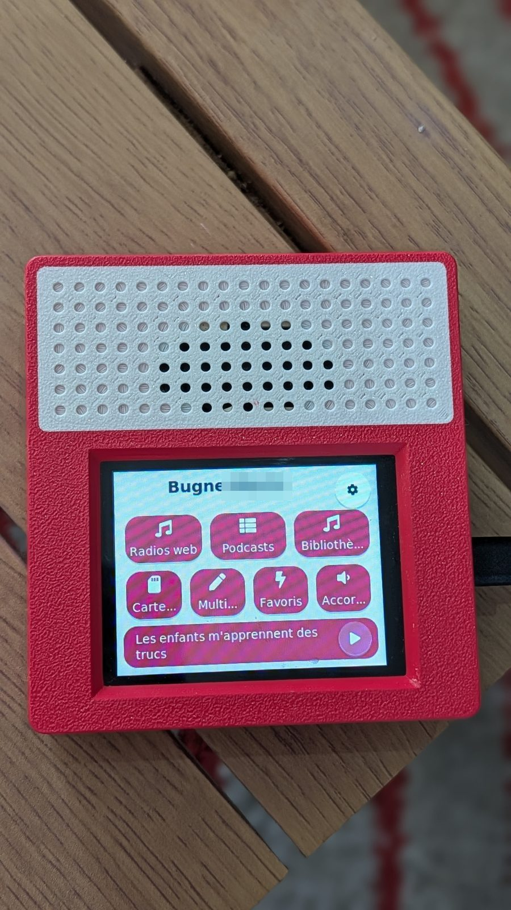
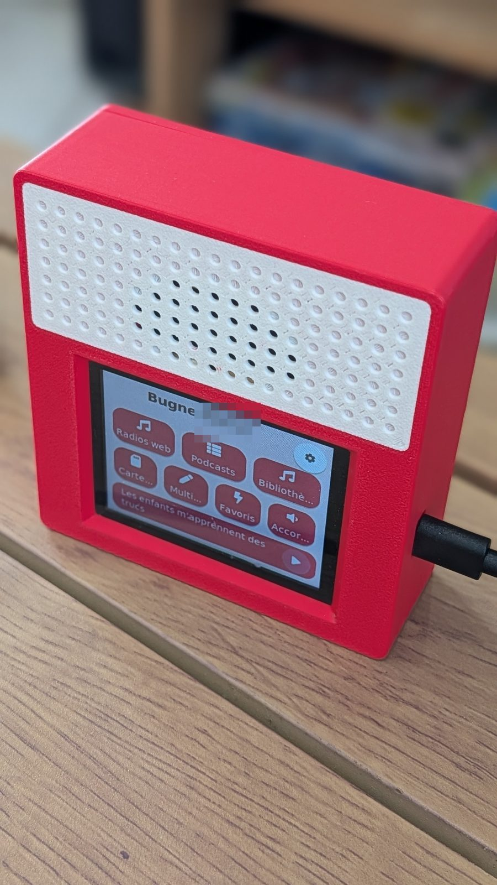
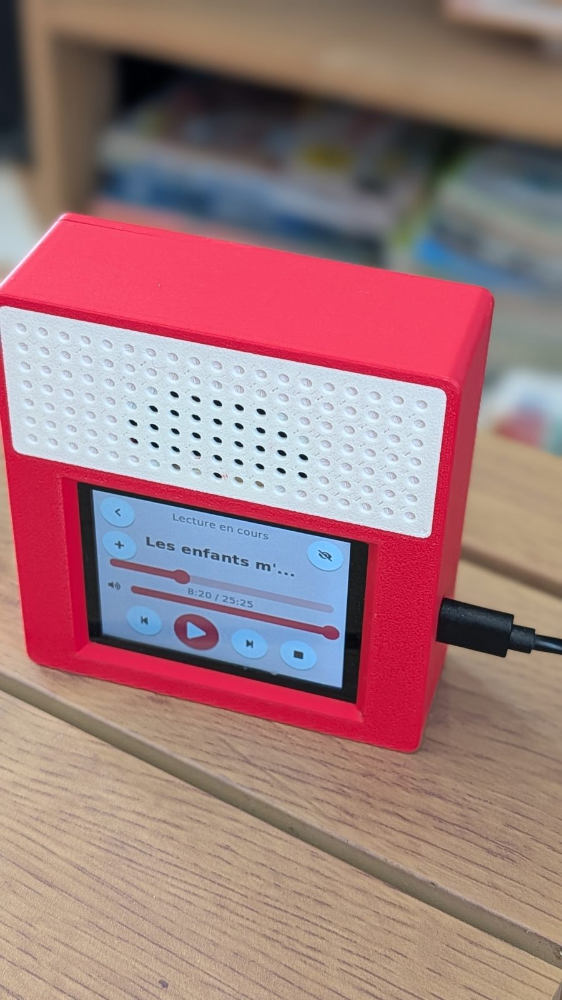

# Bugne

Bugne is an open-source children's audio player firmware for the ESP32-S3.
It runs on the LCDWIKI ES3C28P board and plays audio from three sources, all
mixed through one shared output:

- Local music on a microSD card (MP3, FLAC, AAC/.m4a, Ogg Opus/Vorbis).
- Web radio and podcasts streamed over HTTP and HTTPS.
- Sendspin, the native playback protocol of Music Assistant.

It has a touch screen UI (LVGL), a self-hosted Wi-Fi setup flow with a captive
portal, and an embedded web page to manage Wi-Fi, web radios and podcast feeds.

To get from purchase to the first radio, follow the
[quick start](docs/quickstart.md) ([français](docs/quickstart_fr.md)).

<p>



</p>

The firmware was developed with substantial help from AI coding assistants.

## Status

Feature-complete and validated on real hardware (display, touch, audio, SD,
Wi-Fi, Sendspin sync, OTA including rollback). Builds with ESP-IDF 5.5. The
implemented feature set:

- Config in flash: NVS (Wi-Fi credentials, hashed config password) and LittleFS
  (config.json). Works with or without an SD card.
- Shared audio output (ES8311 + I2S) with a single-active-source arbiter.
- Three sources: SD files, HTTP/HTTPS web radio and podcasts, and a Sendspin
  player auto-discovered by Music Assistant over mDNS.
- Per-radio pre-roll ad skip: an optional decoy connection absorbs the ad some
  stations (e.g. OUI FM) inject at connect time, so the real connection joins
  the live stream directly.
- MP3 (dr_mp3), FLAC (dr_flac), AAC-LC (esp_audio_codec + minimp4 for .m4a) and
  Ogg Opus/Vorbis (esp_audio_codec simple decoder) decoding shared by the SD and
  stream sources.
- SD music library: browse by artist and album, tags, auto-advance playlists.
- On-device podcast RSS parsing (yxml) to a fixed-schema manifest, unlimited
  episodes, per-podcast intro skip.
- Episode download to SD: background engine that runs only when idle, survives
  reboots, plus idle auto-maintenance (refresh feeds, download new, rescan).
- Podcast playback resume: the last interrupted episode's position is saved to
  NVS as it plays and offered again on the next reboot (survives power loss).
- Home-grown Wi-Fi manager: AP provisioning with a captive portal, station mode
  with strongest-first selection and roaming, mDNS hostname.
- Embedded config web page behind a login: responsive (phone and desktop,
  light/dark), bilingual EN/FR. Wi-Fi, radios, podcasts, playback control,
  music library browsing and playback, SD file manager, config backup/restore,
  logs, and OTA firmware update with automatic rollback of a crash-looping
  image. Updates install from a local .bin upload or straight from the latest
  GitHub release (check + one-click install in Settings).
- Times-tables practice game (1 to 10): on-screen keypad, 10/5 points per
  first/second try, endless play, persistent high score.
- Voice memos: record a message with the onboard mic (up to 60 s,
  level-normalized), keep it on the SD card or send it to another Bugne
  discovered on the same network; the receiver shows a discreet red-dot
  alert on its home screen and plays the memo from the Memos screen.
  Parents can turn off receiving from the web page.
- Walkie-talkie mode: hold-to-talk voice messages between two Bugnes on
  the same network, auto-played when both devices are on the talkie
  screen (stored as a regular memo otherwise, never lost); ephemeral by
  design, with a volume slider on the memo and talkie screens.
- LVGL touch UI, kid-friendly "playful tiles" design: home screen of large
  rounded tiles, round transport buttons, floating mini player bar, card list
  rows, now-playing with big bold titles, two setup QR codes, screen sleep,
  selectable UI language (English/French), selectable portrait or landscape
  orientation, and a theme picker (light or dark mode plus 5 accent colors);
  orientation and theme switch from the on-device Settings or the web page,
  applied live, no reboot.
- Alarm clock: up to 3 alarms, weekday schedule, each plays a configured web
  radio or SD track with a gentle 60 s volume ramp, snooze (+10 min) or stop on
  the ringing screen, and an always-sounds beep fallback if the source cannot
  play. Home screen shows the current time (SNTP, configurable timezone) when
  idle.
- Quiet hours (parental): up to 2 time windows (start, end, weekdays) during
  which all playback (local, streaming, Music Assistant) and the game are
  blocked on the device; home tiles grey out and a toast explains the refusal.
  The alarm still rings. Configured on the web Settings tab only.
- Listening statistics (parental): minutes listened per day per source (radio,
  podcast, SD, Music Assistant) and the most-listened titles, shown as a
  last-7-days chart on the web Settings tab. The data stays on the device only
  (never sent anywhere), keeps the last 30 days, and is resettable at any time
  from the web page.
- Remote screen capture for debugging: GET /api/screenshot returns the live
  screen as a BMP (tools/screenshot.py fetches and converts to PNG), and
  POST /api/debug/nav navigates the UI to a named screen.
- Home Assistant ready: the device advertises an `_bugne._tcp` mDNS service
  (TXT: id, version, name) for discovery, exposes a GET /api/status snapshot
  (version, uptime, RSSI, free RAM, SD usage) and POST /api/reboot, and the
  whole API accepts stateless HTTP Basic auth (the web page password) so
  external clients do not fight the browser session.

## Hardware

Board: **LCDWIKI ES3C28P**, an ESP32-S3 board (16MB flash, 8MB PSRAM) with a
2.8 inch ILI9341V display, FT6336G capacitive touch, ES8311 audio codec,
microphone, microSD slot and USB port. Buy it under that exact reference; the
speaker ships with the board. The full pin map and board notes live in
[docs/hardware.md](docs/hardware.md).

The board also carries a TP4054 charger and a JST 1.25mm port for a 1S 3.7V
LiPo battery. Battery operation is untested by this project so far: possible
in principle, not recommended yet. Power the device over USB.

## 3D-printed case

[case/](case) holds ready-to-print designs plus the CadQuery scripts that
generate them (edit a script and rerun it to customize):

- Plain two-piece case (`es3c28p_boitier_facade.stl` +
  `es3c28p_boitier_fond.stl`): portrait, sound exits through a grid in the
  back.
- Vintage radio cabinet (`es3c28p_radio_*.stl`): landscape, vertical front,
  sloped back, screwed rear cover.
- Seventies cabinet (`es3c28p_seventies_*.stl`, a 1970s-inspired look):
  landscape, perforated speaker plate, separate stand.
  This is the recommended design.

The radio and seventies cabinets print face down (front on the bed) with no
supports. Their `*_corps+grille.step` files combine body and grille so a
multi-color printer can put the grille plate in a second color; a single
color works too. Assembly needs 4x M3 6mm screws to mount the board to the
case, and 4x M3 10mm screws to close the case cover.


## Build

Requires ESP-IDF v5.5 or newer.

```
idf.py set-target esp32s3
idf.py build
idf.py -p <PORT> flash monitor
```

## First flash (new board)

A brand-new board needs one full flash over USB: bootloader, partition
table, OTA data and app. The `bugne.bin` release asset alone is an OTA app
image; it updates a running Bugne but cannot bootstrap a blank chip.

Without ESP-IDF, using the release bundle:

1. Download `bugne-flash.zip` from the
   [latest release](https://github.com/Tupile/bugne-releases/releases/latest)
   and unzip it.
2. Install esptool: `pip install esptool`.
3. Plug the board in over USB and run `./flash.sh [PORT] [--erase]`.
   `--erase` wipes the whole flash first (recommended for a clean first
   install). If no serial port shows up, hold the BOOT button while
   plugging in the cable to enter download mode, then retry.

On Windows, run the `esptool write_flash` command spelled out in `flash.sh`
(same four binaries, offsets 0x0 / 0x8000 / 0xf000 / 0x20000).

With ESP-IDF installed, `idf.py -p <PORT> flash` from a source build (see
Build above) does the same in one step.

After flashing, the device boots into Bugne and, with no Wi-Fi stored,
raises its `Bugne-Setup-XXXX` hotspot: the
[quick start](docs/quickstart.md) walks through the setup.

## Documentation

- [docs/quickstart.md](docs/quickstart.md): quick start, from purchase to the
  first radio ([français](docs/quickstart_fr.md)).
- [docs/manual/en.md](docs/manual/en.md): user manual, with screenshots.
- [docs/manual/fr.md](docs/manual/fr.md): mode d'emploi en français.
- [docs/hardware.md](docs/hardware.md): GPIO map and board notes.
- [docs/releasing.md](docs/releasing.md): how releases are published
  (maintainers and forks).
- [docs/config_schema.md](docs/config_schema.md): JSON config contract.
- [docs/manifest_schema.md](docs/manifest_schema.md): podcast manifest contract.

## License

MIT. See [LICENSE](LICENSE). Third-party components and their licenses are
listed in [docs/THIRD_PARTY.md](docs/THIRD_PARTY.md).
