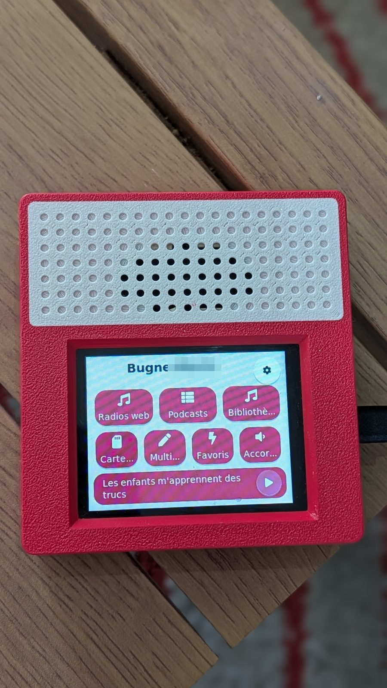
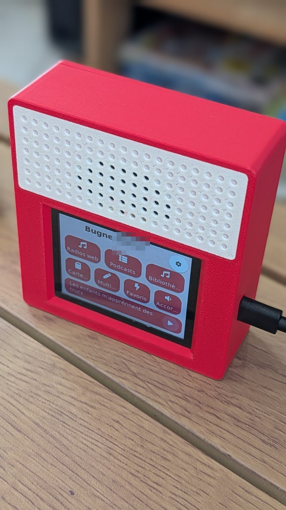
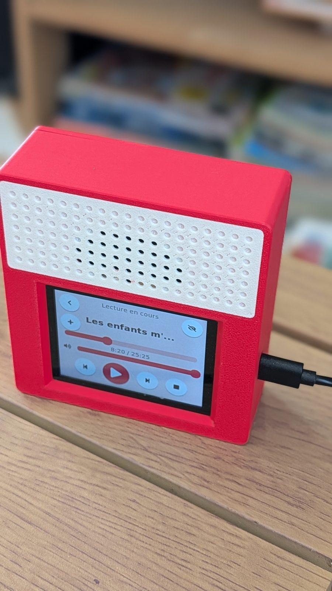

# Bugne

Bugne is open-source firmware for a children's audio player. It runs on the
ESP32-S3, on the LCDWIKI ES3C28P board. It plays audio from three sources
through one shared output:

- Local music on a microSD card: MP3, FLAC, AAC (.m4a) and Ogg Opus/Vorbis.
- Web radio and podcasts, streamed over HTTP and HTTPS.
- Sendspin, the native playback protocol of Music Assistant.

The device has a touch screen with an LVGL interface. For the first setup it
raises its own Wi-Fi hotspot with a captive portal. After that it serves a web
page where a parent manages the Wi-Fi networks, the web radios and the podcast
feeds.

To go from purchase to the first web radio, follow the
[quick start](docs/quickstart.md) ([français](docs/quickstart_fr.md)).

<p>



</p>

The firmware was developed with substantial help from AI coding assistants.

## Status

Version 1.9.6. Feature-complete and validated on real hardware: display, touch,
audio, SD card, Wi-Fi, Sendspin sync, and firmware update with rollback. It
builds with ESP-IDF 5.5. The implemented feature set:

**Storage**

- NVS holds the Wi-Fi credentials and the hashed web page password.
- LittleFS holds `config.json`.
- The device works with or without an SD card. The SD card holds bulk content
  only: music, cached episodes and manifests. You can insert or remove the
  card while the device runs; it notices by itself within about half a minute,
  with no reboot.

**Audio**

- One shared output: the ES8311 codec and the I2S driver. An arbiter keeps one
  source active at a time.
- The SD card source and the stream source share the same decoders. The
  decoders are MP3 (dr_mp3), FLAC (dr_flac), AAC-LC (esp_audio_codec, with
  minimp4 for `.m4a`) and Ogg Opus/Vorbis (esp_audio_codec).
- SD music library: browse by artist and by album, read the tags, play a folder
  with auto-advance.
- Cover art on the now-playing screen, in landscape only. The device reads the
  picture from the MP3 or the FLAC file. Each podcast feed keeps one cover
  image on the SD card.
- Per-radio pre-roll ad skip. Some stations send an advertisement when a player
  connects, OUI FM for example. A decoy connection absorbs that advertisement,
  so the real connection joins the live audio directly.

**Podcasts**

- The device parses the RSS feed itself with yxml and writes a fixed-schema
  manifest. The number of episodes is not limited. Each feed can skip its own
  intro.
- The web page searches the Apple Podcasts directory: type a name, add a show
  with one click, and set the intro skip while you listen to the latest
  episode in the browser. You can also paste any RSS address by hand.
- The device downloads episodes to the SD card. The download engine runs only
  when nothing plays, and continues after a reboot. When the device stays idle
  it also refreshes the feeds, downloads the new episodes and rescans the SD
  card.
- The device saves the position of the episode as it plays. After a power cut
  it offers to continue from that position.

**Network and web page**

- This project has its own Wi-Fi manager. It provisions through its own access
  point and a captive portal. In station mode it joins the strongest known
  network and roams between networks. It publishes an mDNS host name.
- The firmware embeds the web page, and a login protects it. The page works on
  a phone and on a desktop, in light and dark mode, in English and in French.
- From that page a parent manages the Wi-Fi networks, the web radios and the
  podcast feeds. A parent also controls the playback, browses the music library
  and the files on the SD card, and reads the logs. The page saves and restores
  the configuration, and it installs a firmware update.
- A firmware update installs from a local `.bin` file, or directly from the
  latest GitHub release. The bootloader reverts an image that crashes at boot.
- Crash report: the device writes a coredump to flash. The web page then shows
  the failed task, the program counter, the cause and the backtrace.

**On the device**

- The interface uses large rounded tiles, round transport buttons, a floating
  mini player bar and card list rows. Two QR codes help with the setup.
- The screen sleeps while the audio plays.
- The parent selects the language (English or French), the orientation
  (portrait or landscape), light or dark mode, and one of 5 accent colors. The
  device applies each change at once, with no reboot.
- Alarm clock: up to 3 alarms with a weekday schedule. An alarm plays a web
  radio or a track from the SD card and raises the volume over 60 s. It can
  also light the screen before it rings. The child snoozes it for 10 min or
  stops it on the ringing screen. A beep sounds if the source cannot play.
- The home screen shows the time when nothing plays. The time comes from SNTP,
  with a configurable time zone.
- Times-tables game, 1 to 10. The child answers on a keypad and scores 10 or 5
  points. The device keeps the best score.
- The game also has a review mode, built on a Leitner system. The device asks
  more often about the facts the child knows less well. It counts the mastered
  facts out of 100. "Express 20" starts a session of 20 questions.
- Instrument tuner (experimental): the microphone detects the pitch on the
  device.
- Voice memos: the child records a message with the microphone, up to 60 s. The
  device keeps it on the SD card, or sends it to another Bugne on the same
  network. The receiver shows a small red dot on its home screen and plays the
  memo from the Memos screen. A parent stops the reception from the web page.
- Walkie-talkie mode: the child holds a button to talk to another Bugne. The
  message plays at once if both devices show the talkie screen. If not, the
  device stores it as a normal memo, so it loses no message. The device deletes
  these messages after playback.
- Listening time screen: the child reads the time counted today and the time
  that remains before the daily limit.

**Parental controls**

- Quiet hours: up to 2 windows with a start, an end and a weekday selection.
  During a window the device refuses every playback, local, streamed or from
  Music Assistant, and refuses the game. The home tiles turn grey and a message
  explains the refusal. The alarm still rings.
- Daily limit: a maximum listening time per day. The counter survives a reboot.
  The device warns the child 5 min before the limit.
- Listening statistics: minutes per day and per source (radio, podcast, SD
  card, Music Assistant) plus the most played titles, as a 7-day chart. The
  data stays on the device, covers the last 30 days, and the parent erases it
  at any time.
- Maximum volume, and two switches that hide the game tile or the tuner tile.
- The parent sets all of these on the web Settings tab.

**Music Assistant and Home Assistant**

- Music Assistant finds the device over mDNS as a Sendspin player. The
  now-playing screen shows the title, the artist and the progress. A drag on
  the progress bar seeks the session when the server offers seek.
- The device publishes an `_bugne._tcp` mDNS service with the TXT records `id`,
  `version` and `name`.
- The whole HTTP API accepts stateless HTTP Basic authentication, so Home
  Assistant calls it without a login step.
- The device can switch a Home Assistant light from a home screen tile
  (experimental). It needs a long-lived access token.

## Hardware

Board: **LCDWIKI ES3C28P**, an ESP32-S3 board (16MB flash, 8MB PSRAM) with a
2.8 inch ILI9341V display, FT6336G capacitive touch, ES8311 audio codec,
microphone, microSD slot and USB port. Buy it under that exact reference. The
speaker ships with the board. The full pin map and the board notes are in
[docs/hardware.md](docs/hardware.md).

If you wish to support this project at no extra cost, you can order the board via this
[Aliexpress affiliate link](https://s.click.aliexpress.com/e/_c4OZeS8F)
(or this [alternative link](https://s.click.aliexpress.com/e/_c3MmlBCJ) if
unavailable). Make sure to select the touch model "ES3C28P". For users in France,
you can also use this [Amazon affiliate link](https://amzn.to/3RrzKT1).

The board also carries a TP4054 charger and a JST 1.25mm port for a 1S 3.7V
LiPo battery. This project did not test battery operation. It is possible in
principle, but not recommended yet. Power the device over USB.

## 3D-printed case

[case/](case) holds ready-to-print designs and the CadQuery scripts that
generate them. Edit a script and run it again to customize a design. The same
designs are ready for BambuLab printers on
[MakerWorld](https://makerworld.com/en/models/3073793-bugne-open-source-internet-radio-podcast-player):

- Plain two-piece case (`es3c28p_boitier_facade.stl` +
  `es3c28p_boitier_fond.stl`): portrait, the sound exits through a grid in the
  back. It closes with 4x M3 20mm screws that enter from the back. The heads
  are recessed in the back panel, so no screw shows on the front.
- Vintage radio cabinet (`es3c28p_radio_*.stl`): landscape, vertical front,
  sloped back, screwed rear cover.
- Seventies cabinet (`es3c28p_seventies_*.stl`, a 1970s-inspired look):
  landscape, perforated speaker plate.
  This is the recommended design.

Print the radio cabinet and the seventies cabinet face down, front on the bed,
with no supports. Their `*_corps+grille.step` files combine the body and the
grille, so a multi-color printer can print the grille plate in a second color.
A single color works too. Assembly needs 4x M3 6mm screws for the board and 4x
M3 10mm screws for the cover.

If you do not have a 3D printer, a service such as PCBWay or Craftcloud prints
the case and delivers it. For the seventies model, order
`es3c28p_seventies_corps+grille.step` and `es3c28p_seventies_capot.stl` in PLA.


## Build

The build needs ESP-IDF v5.5 or newer.

```
idf.py set-target esp32s3
idf.py build
idf.py -p <PORT> flash monitor
```

## First flash (new board)

A new board needs one full flash over USB: bootloader, partition table, OTA
data and app. The `bugne.bin` release asset is an OTA app image only. It
updates a running device, but it cannot start a blank chip.

The easiest way is the browser (Chrome, Edge, Opera):
1. Connect the board to your computer over USB. Hold the BOOT button while you
   plug the cable in, to enter bootloader mode.
2. Open the [Web Flasher](https://tupile.github.io/bugne-releases/tools/web-flasher/) page.
3. Click "Installer", select the COM port of the board, and wait for the end of
   the installation.

For offline use, or for troubleshooting, flash from the command line with the
release bundle:
1. Download `bugne-flash.zip` from the
   [latest release](https://github.com/Tupile/bugne-releases/releases/latest)
   and unzip it.
2. Install esptool: `pip install esptool`.
3. Connect the board over USB and run `./flash.sh [PORT] [--erase]`. `--erase`
   clears the whole flash first. Use it for a first install. If no serial port
   shows up, hold the BOOT button while you plug the cable in, then try again.

On Windows without the script, run the `esptool write_flash` command written in
`flash.sh`. It uses the same four binaries, at the offsets 0x0, 0x8000, 0xf000
and 0x20000.

With ESP-IDF installed, `idf.py -p <PORT> flash` from a source build does the
same in one step. See Build above.

After the flash the device starts Bugne. With no Wi-Fi stored it raises its
`Bugne-Setup-XXXX` hotspot. The [quick start](docs/quickstart.md) goes through
the setup.

## HTTP API

The device serves this API on port 80. Every route needs the web page login or
an `Authorization: Basic` header. `POST /api/memo` is the only exception. A
peer device does not know the password, so that route stays open on the local
network. A parent can switch it off.

`POST /api/config` is a full replace. Read the configuration with
`GET /api/config`, change it, then post the whole object back.

| Route | Method | Purpose |
|---|---|---|
| `/` | GET | The web page, or the login page |
| `/login` | POST | Open a session |
| `/api/config` | GET, POST | Read or replace `config.json` |
| `/api/wifi` | GET, POST | Read or write the saved Wi-Fi networks |
| `/api/scan` | GET | Scan for the Wi-Fi networks in range |
| `/api/password` | POST | Change the web page password |
| `/api/playback` | GET, POST | Read the playback state, or play, pause, stop, set the volume, seek |
| `/api/library` | GET | Browse the SD music library |
| `/api/library/scan` | POST | Rescan the SD music library |
| `/api/sd/list` | GET | List a folder on the SD card |
| `/api/sd/download` | GET | Download a file from the SD card |
| `/api/sd/upload` | POST | Upload a file to the SD card |
| `/api/sd/mkdir` | POST | Create a folder on the SD card |
| `/api/sd/delete` | POST | Delete a file or a folder on the SD card |
| `/api/podcasts/refresh` | GET, POST | Start a feed refresh, or read its progress |
| `/api/podcasts/download` | GET, POST | Start an episode download, or read its progress |
| `/api/podcasts/download/cancel` | POST | Cancel the download job |
| `/api/memo` | POST | Receive a voice memo from another device |
| `/api/stats` | GET | Read the listening statistics |
| `/api/stats/reset` | POST | Erase the listening statistics |
| `/api/status` | GET | Snapshot: id, name, version, uptime, free RAM, RSSI, IP, SD card usage, reset reason, crash flag |
| `/api/logs` | GET | Read the recent log lines |
| `/api/coredump` | GET | Read the crash report |
| `/api/coredump/erase` | POST | Erase the crash report |
| `/api/ota` | POST | Install an uploaded firmware image |
| `/api/ghota/check` | GET | Compare the running version with the latest GitHub release |
| `/api/ghota` | POST | Install the latest GitHub release |
| `/api/ghota/status` | GET | Read the progress of that installation |
| `/api/reboot` | POST | Stop the playback and restart the device |
| `/api/screenshot` | GET | Capture the live screen as a BMP file |
| `/api/debug/nav` | POST | Open a named screen |

`tools/screenshot.py <ip> <out.png>` fetches a screenshot and converts it to
PNG. `tools/manual_shots.py` uses `/api/debug/nav` and `/api/screenshot` to
regenerate the manual images.

## Documentation

- [docs/quickstart.md](docs/quickstart.md): quick start, from purchase to the
  first web radio ([français](docs/quickstart_fr.md)).
- [docs/manual/en.md](docs/manual/en.md): user manual, with screenshots.
- [docs/manual/fr.md](docs/manual/fr.md): mode d'emploi en français.
- [docs/hardware.md](docs/hardware.md): GPIO map and board notes.
- [docs/releasing.md](docs/releasing.md): how releases are published
  (maintainers and forks).
- [docs/config_schema.md](docs/config_schema.md): JSON config contract.
- [docs/manifest_schema.md](docs/manifest_schema.md): podcast manifest contract.

## License

MIT. See [LICENSE](LICENSE). The third-party components and their licenses are
listed in [docs/THIRD_PARTY.md](docs/THIRD_PARTY.md).
