# Bugne user manual

[Version française](fr.md)

Bugne is a small touch-screen music box for kids: web radios, podcasts
(also offline), music from an SD card, an alarm clock, a times-tables game
and an instrument tuner. Parents manage everything from a web page on their
phone or computer.

This manual has four parts: installing the firmware (only for a freshly
built device), setting up the device (for parents), using it every day
(simple enough for a child), and the parents' corner (the web page,
alarms, quiet hours, updates).

## 1. Meet your Bugne

- A 2.8 inch color touch screen. Everything is done by tapping it.
- A speaker on the front and a small microphone hole (used by the tuner).
- A USB port on the side: it powers the device and charges the internal
  battery.
- A microSD card slot for your own music and for storing podcast episodes.
- A BOOT button: you normally never need it.

Turn it on: plug it in or use the power switch. The home screen appears in
about one second.

## 2. Installing the firmware (first flash)

Skip this section if your Bugne already shows something on screen: it only
concerns a freshly assembled board (or a full recovery). Normal updates
are done from the web page (see "Firmware updates" in section 6).

You need a computer with Python installed and a USB data cable.

1. Install esptool (the standard Espressif flashing tool):
   `pip install esptool`.
2. Download `bugne-flash.zip` from the latest release at
   <https://github.com/Tupile/bugne-releases/releases/latest> and unzip
   it.
3. Connect the board to the computer over USB.
4. In the unzipped folder, run `./flash.sh --erase` (Linux/macOS). On
   Windows, run the `esptool` command written inside `flash.sh`.
5. If no serial port is found, hold the BOOT button while plugging in the
   USB cable, then run the script again.

When the script finishes, the device restarts into Bugne and opens its
`Bugne-Setup-XXXX` hotspot: continue with the next section.

## 3. First-time setup (parents)

You need: a 2.4 GHz Wi-Fi network, a phone, and optionally a microSD card
(FAT32) with music on it.

1. Power the device on. Since it knows no Wi-Fi network yet, it opens its
   own setup hotspot and shows a QR code.
2. Scan the QR code with your phone. It joins the hotspot named
   `Bugne-Setup-XXXX` (the XXXX is unique to your device, and so is the
   hotspot password, which is embedded in the QR code).
3. The configuration page opens by itself after joining (if it does not,
   open `http://192.168.4.1` in the phone browser).
4. On that page, choose your home Wi-Fi network and enter its password.
   The device connects and the hotspot disappears.
5. From now on the configuration page is available on your home network at
   the address shown on the device under Settings, then "Config page (QR)".
   Scan that QR code or type the address, which looks like
   `http://bugne-xxxx.local`.
6. Optional: insert a microSD card with music. Folders and files appear
   under the SD card tile. MP3, FLAC, AAC (.m4a), Ogg Opus and Ogg Vorbis
   files play.
7. Optional but recommended: on the web page, open Settings and set a page
   password, so kids cannot open the parent settings from their own
   devices.

You can add several Wi-Fi networks (home, grandparents, ...). The device
picks the strongest one it can see and switches by itself when needed. If
it cannot reach any known network for about 30 seconds, the setup hotspot
comes back so you can fix the configuration.

## 4. Everyday use

### The home screen

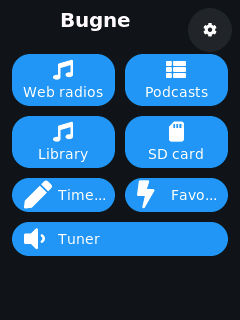

Big colored tiles: Web radios, Podcasts, Library, SD card, and depending on
what the parents enabled: Times tables (the game), Favorites, Tuner. The
gear at the top right opens the settings. When nothing is playing and the
clock is set, the time shows at the bottom.

### Listening to web radio

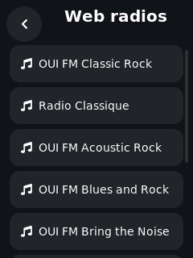

Tap the Web radios tile, then tap a station. It starts playing and the
now-playing screen opens. This needs Wi-Fi: the tile is greyed out when the
device is offline.

### Podcasts

 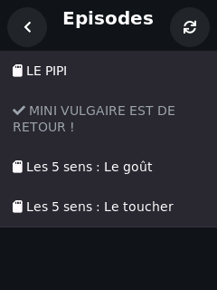

Tap Podcasts, pick a show, then pick an episode. The small icon in front of
each episode tells you how it will play:

- SD card icon: the episode is saved on the card and plays even without
  Wi-Fi.
- Download icon: the episode will stream over Wi-Fi. Without Wi-Fi these
  rows are greyed out.
- Grey row with a checkmark: you already listened to it.

The round arrows button at the top right refreshes the episode list from
the internet.

### Your music (SD card and Library)

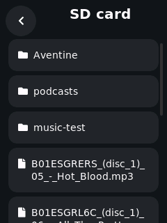 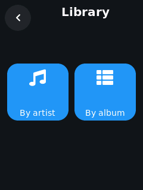

The SD card tile browses the card folder by folder. The Library tile shows
the same music sorted by artist or by album. In a folder or an album, the
next and previous buttons move between tracks.

### Favorites

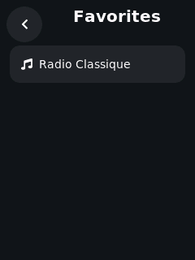

While something is playing, tap the round + button on the now-playing
screen to keep it as a favorite (radios, tracks and downloaded episodes,
up to 12). The Favorites tile plays them back in one tap. Tap the same
button again (now a minus) to remove a favorite.

### The now-playing screen

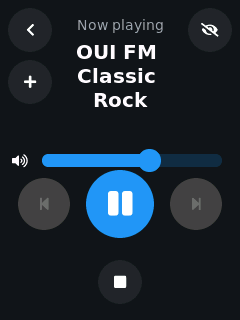

- The big round button pauses and resumes.
- The small square button below stops.
- Previous and next skip tracks or episodes (they do nothing on a radio).
- The slider changes the volume (parents can cap the maximum).
- The + button adds or removes a favorite.
- The eye button is the sleep timer: each tap cycles through off, 15, 30,
  45, 60 minutes, then "end of track". The music stops by itself when the
  time is up. Perfect for bedtime.
- The back arrow returns to the menus while the music keeps playing. A
  small bar at the bottom of every screen shows what is playing; tap it to
  come back.

The screen switches off by itself after a while; the music keeps playing.
Touch the screen to wake it up.

### The times-tables game

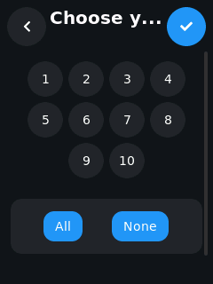 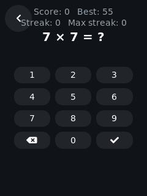

Tap the game tile, pick which tables you want to practice (or All), then
tap the check button. Answer with the keypad. Score, best score and streak
are at the top; the best score is remembered.

### The tuner

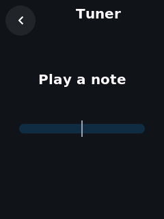

Open the Tuner tile and play a note on your instrument close to the
device. The screen shows the note name, its frequency, and a bar that tells
you if you are flat (left) or sharp (right). Tune until the bar is
centered.

### Device settings

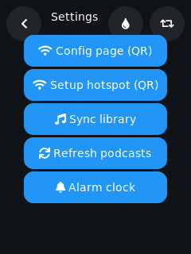 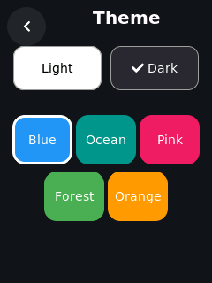

The gear on the home screen opens the settings: the two QR codes (config
page and setup hotspot), music library sync, podcast refresh, and the alarm
clock. The droplet button picks the theme (light or dark, five colors); the
loop button flips the screen between portrait and landscape.

### The alarm clock

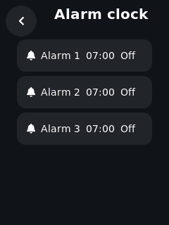

Up to three alarms. For each one you set: on or off, the time, the days of
the week, what it plays (a web radio or a track from the SD card) and its
volume. The sound starts quietly and ramps up. If the chosen radio cannot
be reached, the device beeps instead: the alarm always sounds. While it
rings you can snooze it (10 minutes) or stop it; it stops by itself after
30 minutes. Alarms also work from the web page, and they ring even during
quiet hours.

## 5. Parents' corner: the web page

Open `http://bugne-xxxx.local` (or scan the QR under Settings, then
"Config page (QR)") from any phone or computer on the same Wi-Fi. If you
set a page password, log in first. Five tabs at the bottom (or top on a
computer).

### Play

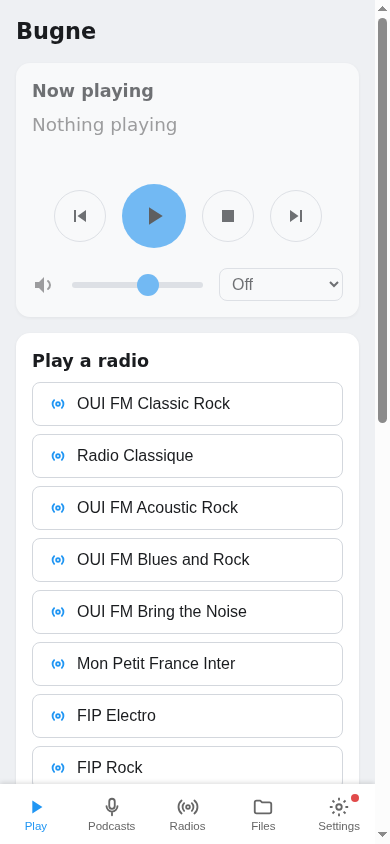

A remote control: see what is playing, pause, stop, skip, change the
volume, set the sleep timer, and start any radio or any track from the
library.

### Podcasts

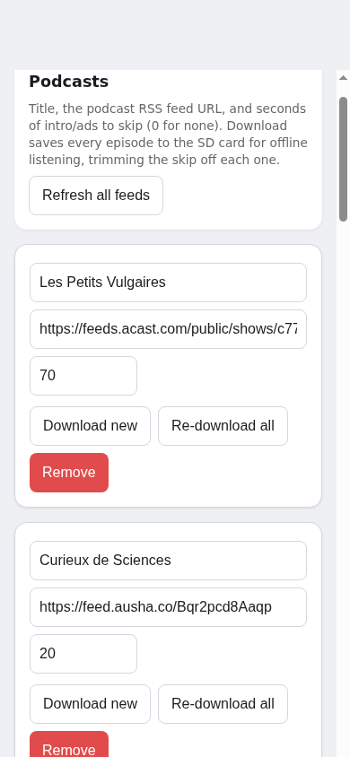

Add a podcast with its RSS feed URL. The intro-skip field cuts the first N
seconds of every episode (sponsor jingles). "Download new" saves fresh
episodes to the SD card for offline listening; downloads run when the
device is idle and pause when a child plays something. The device also
refreshes feeds and downloads new episodes by itself when it has been idle
for a while.

### Radios

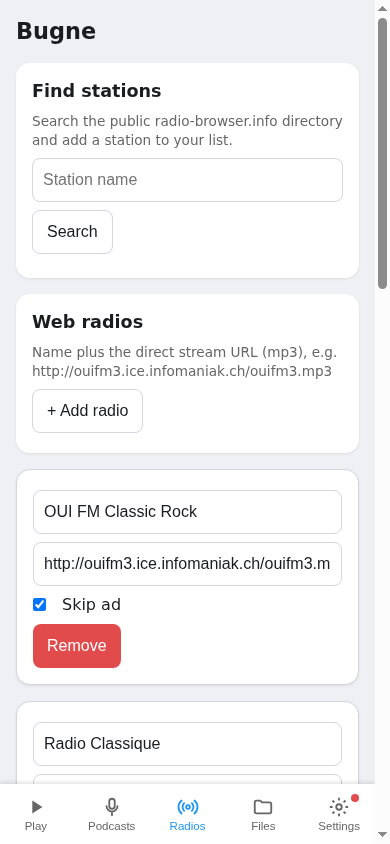

Search the public radio-browser.info directory and add stations in one
tap, or add one manually with its name and direct stream URL. "Skip ad"
mutes the pre-roll advert some stations play when you tune in.

### Files

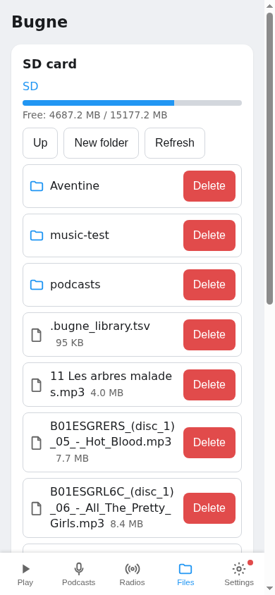

Browse the SD card, check free space, create folders and delete files.

### Settings

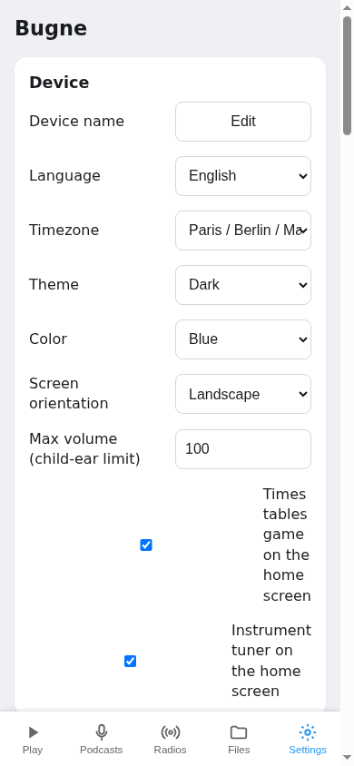

Everything else lives here:

- Device name, language (English or French: the device screen and this
  page follow it), timezone.
- Theme, color and screen orientation of the device.
- Max volume: a hard ceiling for little ears. Whatever a child (or anything
  else) asks for, the device never plays louder.
- Show or hide the game and tuner tiles.
- Alarms: same three alarms as on the device.
- Quiet hours: up to two time windows (for example 20:30 to 07:00) during
  which nothing can be played and the game will not open. The alarm still
  rings. Handy for nights and homework time.
- Listening statistics: minutes listened per day and per source over the
  last week, and the most-listened titles. The data never leaves the
  device and can be reset at any time.
- Wi-Fi networks: add, edit or remove saved networks.
- Page password, backup and restore of the configuration, device logs, and
  firmware updates (see below).

Note: after a firmware update, reload the web page before changing
settings.

## 6. Going further

### Music Assistant and multiroom

Bugne appears automatically as a player in
[Music Assistant](https://music-assistant.io) on the same network (it
speaks the Sendspin protocol). You can send music to it, group it with
other speakers, and control the volume from Music Assistant. The device
screen shows what is playing; pause, stop and volume also work on the
device itself. The max volume ceiling still applies.

### Home Assistant

The device announces itself on the network (mDNS) and offers a small HTTP
API (status, playback control), so it can be integrated into Home
Assistant or any home automation that can call HTTP endpoints.

### Several Bugnes in one home

Each device has its own name, its own web address (`bugne-xxxx.local`) and
its own settings. They do not interfere; use Music Assistant if you want
synchronized playback in several rooms.

### Firmware updates

In the web page Settings tab: check for the latest release and install it
in one tap, or upload a firmware file. The device reboots, keep it powered
during the update. If a new firmware fails to start, the device
automatically returns to the previous one.

## 7. Troubleshooting

- No Wi-Fi at the new place: wait about 30 seconds, the
  `Bugne-Setup-XXXX` hotspot appears. Scan the QR under Settings, then
  "Setup hotspot (QR)" and add the new network.
- Offline (Wi-Fi down): SD music, the library, downloaded episodes, the
  game and the tuner keep working. Radios and non-downloaded episodes are
  greyed out until the connection returns.
- No SD card (or not detected): radios and podcast streaming still work.
  Re-seat the card; use a FAT32-formatted card.
- No sound: check the volume slider, then the max volume ceiling (web
  Settings), and make sure quiet hours are not active.
- A radio stopped by itself: the device retries a dropped stream for about
  two minutes before giving up. If it gave up, just start it again.
- The device does not respond: unplug it, wait a few seconds, plug it back
  in. Settings survive.
- Forgotten page password: there is no reset button on the device. Whoever
  built it can clear it by reflashing over USB with `--erase`, as in
  section 2 (saved Wi-Fi networks and settings are erased too).
