# Bugne user manual

[Version française](fr.md)

Bugne is a small touch screen music box for children. It plays web radios,
podcasts (also offline), and music from an SD card. It also has an alarm clock,
voice memos, a times-tables game and an instrument tuner (experimental). A
parent manages everything from a web page, on a phone or on a computer.

This manual has five parts:

- Build the device: the board and its 3D-printed case.
- Install the firmware.
- Set the device up, for parents.
- Use it every day, simple enough for a child.
- The parents' corner: the web page, the alarms, the quiet hours and the
  updates.

## 1. Meet your Bugne

- A 2.8 inch color touch screen. You tap it to do everything.
- A speaker on the front and a small microphone hole. The tuner and the voice
  memos use that microphone.
- A USB port on the side. It powers the device and charges the battery.
- A microSD card slot for your own music and for podcast episodes.
  If you need a card, you can find them [here](https://s.click.aliexpress.com/e/_c2yej75h)
  or [here](https://s.click.aliexpress.com/e/_c3ywvSmJ) (for users in France,
  you can also use this [Amazon affiliate link](https://amzn.to/3Ta5I6J)).
- A BOOT button. You normally never need it.

To turn the device on, plug it in or use the power switch. The home screen
appears in about one second.

## 2. The hardware: board and 3D-printed case

Bugne is a DIY project. You buy one off-the-shelf board and you print a case
for it.

- The board is an **LCDWIKI ES3C28P**. Use that exact reference. It is an
  ESP32-S3 with 16 MB flash and 8 MB PSRAM, a 2.8 inch capacitive touch
  screen, an audio codec, a microphone, a microSD slot and a USB port.
  The small speaker comes with the board. If you wish to support the
  project at no extra cost, you can order the board via this
  [Aliexpress affiliate link](https://s.click.aliexpress.com/e/_c4OZeS8F)
  (or this [alternative link](https://s.click.aliexpress.com/e/_c3MmlBCJ)
  if unavailable). Make sure to select the touch model "ES3C28P". For users
  in France, you can also use this [Amazon affiliate link](https://amzn.to/3RrzKT1).
- The board also has a battery port and a charger for a single-cell 3.7 V LiPo,
  with a JST 1.25 mm plug. This project did not test battery operation, and
  does not recommend it yet. Power the device over USB.
- The case is 3D printed. The `case/` folder of the project holds three
  designs. They are also ready for BambuLab printers on
  [MakerWorld](https://makerworld.com/en/models/3073793-bugne-open-source-internet-radio-podcast-player).
  The first design is a plain two-piece case: portrait, with the sound through
  a grid in the back. The two others are a "vintage radio" cabinet and a
  "seventies" cabinet: landscape, printed face down with no supports. Their
  speaker grille can take a second color. The seventies cabinet is the
  recommended one. Small screws hold the board and close the back: 4x M3 6mm
  for the board and 4x M3 10mm for the cover, available
  [here](https://s.click.aliexpress.com/e/_c34zawnh).

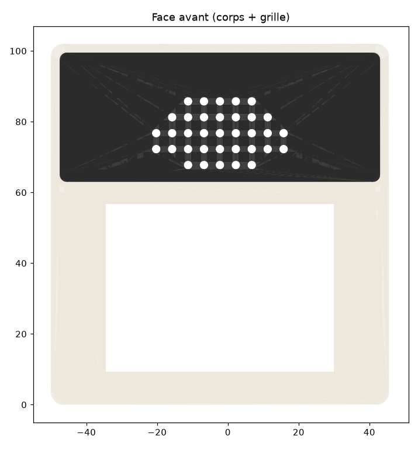

## 3. Installing the firmware (first flash)

Skip this section if your Bugne already shows something on the screen. It
concerns a new board only, or a full recovery. You install the normal updates
from the web page. See "Firmware updates" in section 7.

You need a computer and a USB data cable.

1. Connect the board to your computer over USB. Hold the BOOT button while you
   plug the cable in, to enter bootloader mode.
2. Open the [Web Flasher](https://tupile.github.io/bugne-releases/tools/web-flasher/)
   page with Chrome, Edge or Opera.
3. Click "Installer", select the COM port of the board, and wait for the end of
   the installation.

*(For offline use: download `bugne-flash.zip` from the
[latest release](https://github.com/Tupile/bugne-releases/releases/latest),
install `esptool`, then run the `flash.sh` script in the bundle.)*

At the end the device restarts into Bugne and opens its `Bugne-Setup-XXXX`
hotspot. Continue with the next section.

## 4. First-time setup (parents)

You need a 2.4 GHz Wi-Fi network and a phone. A microSD card (FAT32) with music
on it is optional.

1. Power the device on. It knows no Wi-Fi network yet, so it opens its own
   setup hotspot and shows a QR code.
2. Scan that QR code with your phone. Your phone joins the hotspot
   `Bugne-Setup-XXXX`. The XXXX is unique to your device, and so is the hotspot
   password, which the QR code carries.
3. The web page opens by itself after the phone joins. If it does not, open
   `http://192.168.4.1` in the phone browser.
4. On that page, select your home Wi-Fi network and enter its password. The
   device connects and the hotspot stops.
5. The web page is now on your home network. The device shows its address under
   Settings, then "Config page (QR)". Scan that QR code, or type the address,
   which looks like `http://bugne-xxxx.local`.
6. Optional: insert a microSD card with music. The folders and the files then
   appear under the SD card tile. The device plays MP3, FLAC, AAC (.m4a), Ogg
   Opus and Ogg Vorbis files.
7. Optional but recommended: on the web page, open Settings and set a page
   password. A child then cannot open the parent settings from their own phone.

You can add several Wi-Fi networks: home, grandparents, and so on. The device
joins the strongest one it can see, and it changes network by itself when it
must. If it reaches no known network for about 30 seconds, the setup hotspot
comes back, so you can correct the configuration.

## 5. Everyday use

### The home screen

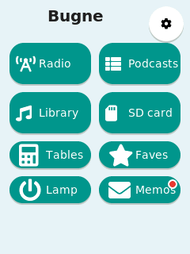

The home screen shows big colored tiles: Web radios, Podcasts, Library, SD card
and Memos. Four more tiles appear when the parents switch them on: Times tables
(the game), Favorites, Tuner (experimental) and Lamp (experimental). The gear at
the top right opens the settings. The time shows at the bottom when nothing
plays and the clock is set.

### Listening to web radio

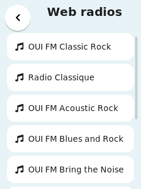

Tap the Web radios tile, then tap a station. It starts and the now-playing
screen opens. This needs Wi-Fi. The tile is grey while the device is offline.

### Podcasts

 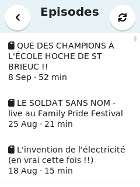

Tap Podcasts, select a show, then select an episode. The small icon in front of
each episode tells you how it plays:

- SD card icon: the episode is on the card. It plays without Wi-Fi.
- Download icon: the episode streams over Wi-Fi. These rows are grey while the
  device is offline.
- Grey row with a checkmark: you listened to it already.

The round arrows button at the top right refreshes the episode list from the
internet.

### Your music (SD card and Library)

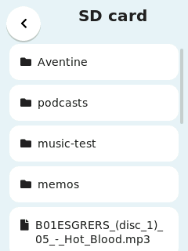 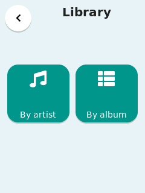

The SD card tile browses the card folder by folder. The Library tile shows the
same music, sorted by artist or by album. In a folder or in an album, the next
and previous buttons move between tracks.

### Favorites

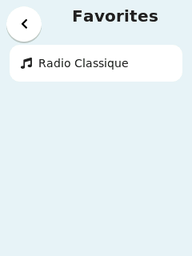

While something plays, tap the round + button on the now-playing screen to keep
it as a favorite. Web radios, tracks and downloaded episodes can be favorites,
up to 12. The Favorites tile plays them back with one tap. To remove a
favorite, tap the same button again. It shows a minus sign.

### The now-playing screen

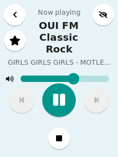

- The big round button pauses and resumes.
- The small square button below it stops.
- Previous and next move between tracks or episodes. They do nothing on a web
  radio.
- The slider changes the volume. A parent can cap the maximum.
- The + button adds or removes a favorite.
- The eye button is the sleep timer. Each tap moves to the next value: off, 15,
  30, 45, 60 minutes, then "end of track". The music stops by itself at the end
  of that time. This is useful at bedtime.
- The back arrow returns to the menus and the music keeps playing. A small bar
  at the bottom of every screen shows what plays. Tap that bar to come back.

In landscape the screen also shows the cover art, at the left of the title. The
device reads the picture inside the MP3 or FLAC file. For a podcast it uses the
image of the feed. A web radio has no cover art.

The screen switches off by itself after a while, and the music keeps playing.
Touch the screen to wake it up.

### The times-tables game

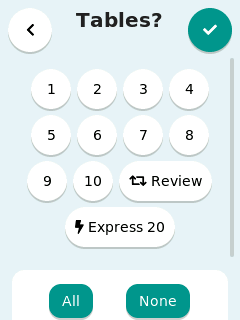 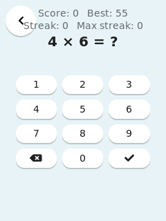

Tap the game tile. On the setup screen, select the tables to practice, or tap
All. Then tap the check button at the top right. Answer with the keypad. The
score, the best score and the streak are at the top. The device keeps the best
score.

The same setup screen has two more chips:

- "Review": the device selects the questions for you. It asks more often about
  the multiplications you miss, and less often about those you know. Each
  correct first answer moves a multiplication one step forward, up to five
  steps. A wrong answer sends it back to the first step. The header shows
  "Mastered: n/100" instead of the score, where 100 is the number of
  multiplications from 1x1 to 10x10.
- "Express 20": the same review, in a session of 20 questions. One tap starts
  it, with no table to select. The header counts the questions. At the end the
  device saves your progress and shows "Session done! Bravo!".

The device keeps the review progress between sessions.

### The tuner (experimental)

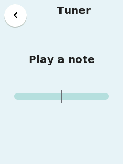

Open the Tuner tile and play a note on your instrument, close to the device.
The screen shows the name of the note, its frequency, and a bar. The bar tells
you if you are flat (left) or sharp (right). Tune until the bar is centered.
*(Note: the tuner is an experimental feature.)*

### The Lamp (experimental)

A Lamp tile appears on the home screen when the parents configure it. It
controls a light through Home Assistant (experimental feature). Tap it to turn
the light of the room on or off.

### Voice memos

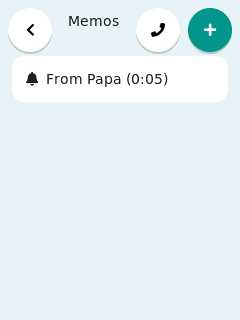 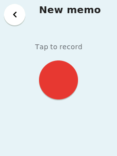

The Memos tile is a small voice mailbox. Tap the + button, then the big red
button, and speak. A memo lasts one minute at most. When you stop, you can
listen to your message, keep it on the device, send it to another Bugne in the
house, or delete it.

A small red dot appears on the Memos tile when a memo arrives, and a message
pops up. Open the tile and tap the line with the bell to listen to it. The
trash button deletes the open memo. To send a memo you need Wi-Fi and another
Bugne on the same network. The device keeps 20 memos at most. A parent stops
the reception from the web page, on the Settings tab. The same switch also
stops the walkie-talkie below.

### Walkie-talkie

The phone button on the Memos screen opens the walkie-talkie. Select the other
Bugne, then hold the big red button and talk. The device sends the message by
itself when you let go. The message plays at once if the other Bugne shows its
walkie-talkie screen too. If it does not, nothing is lost: the message lands in
its memo box. The device does not keep walkie-talkie messages. The slider at
the bottom sets the volume.

### Device settings

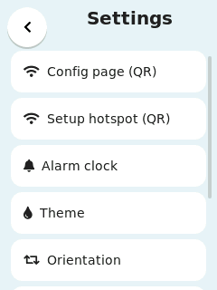 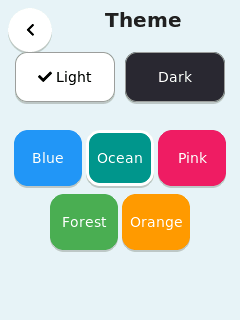

The gear on the home screen opens the settings. It has six rows:

- "Config page (QR)": the QR code of the web page address.
- "Setup hotspot (QR)": the QR code that joins the setup hotspot.
- "Alarm clock": the three alarms. See below.
- "Theme": light or dark, and five colors.
- "Orientation": each tap changes between portrait and landscape.
- "Listening time": the time counted today. With a daily limit set, it also
  shows a bar, the used time against the limit, and the time that remains. A
  child can open this screen at any time, even when the limit is reached.

The music library and the podcast feeds keep themselves up to date. The device
does that work by itself when nobody uses it.

### The alarm clock

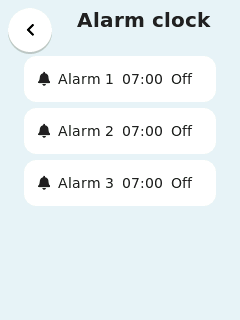

You can set three alarms. For each one you select: on or off, the time, the
days of the week, what it plays, and its volume. An alarm plays a web radio or
a track from the SD card. The sound starts quietly and rises over one minute.
An alarm can also light the screen a few minutes before it rings, like a
sunrise. If the device cannot reach the selected radio, it beeps instead: the
alarm always sounds. While it rings you snooze it for 10 minutes or you stop
it. It stops by itself after 30 minutes. The alarms are also on the web page,
and they ring during the quiet hours too.

## 6. Parents' corner: the web page

Open `http://bugne-xxxx.local` from any phone or computer on the same Wi-Fi.
You can also scan the QR code on the device under Settings, then "Config page
(QR)". Log in first if you set a page password. The page has five tabs, at the
bottom on a phone and at the top on a computer.

### Play

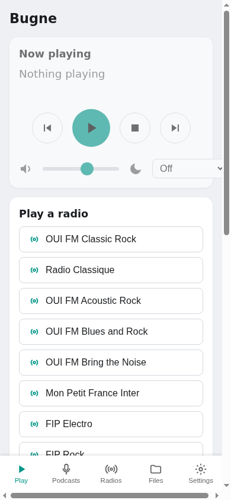

This tab is a remote control. You see what plays. You pause, stop, skip, change
the volume and set the sleep timer. You also start any web radio, or any track
from the library.

### Podcasts

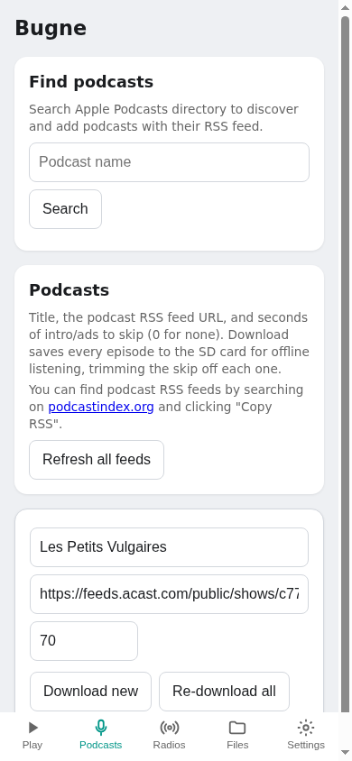

Add a podcast with the URL of its RSS feed. To find that URL, search on
[podcastindex.org](https://podcastindex.org) and click "Copy RSS", then paste
the link into the field. The page refuses to save a podcast with no RSS URL.

The intro-skip field cuts the first N seconds of every episode, for a sponsor
jingle. "Download new" saves the fresh episodes to the SD card for offline
listening. A download runs when nobody uses the device, and pauses as soon as a
child plays something. The device also refreshes the feeds and downloads the
new episodes by itself, after it stays idle for a while.

### Radios

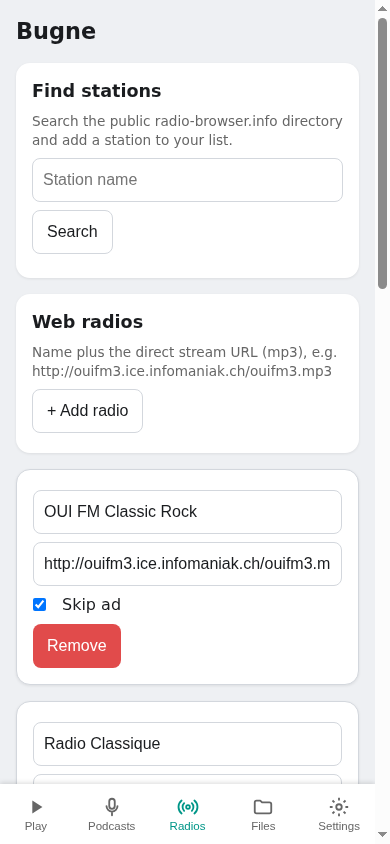

Search the public radio-browser.info directory and add a station with one
click. You can also add a station by hand, with its name and its stream URL.
The page refuses to save a station with no stream URL. "Skip ad" removes the
advertisement that some stations play when a player connects.

### Files

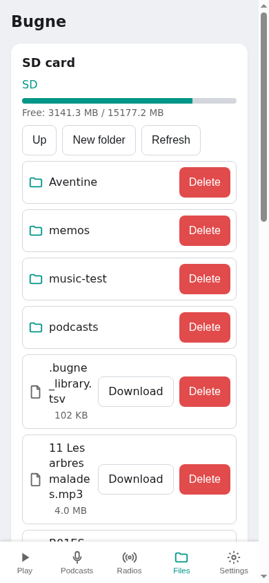

Browse the SD card, read the free space, create folders, upload files, download
files and delete files.

### Settings

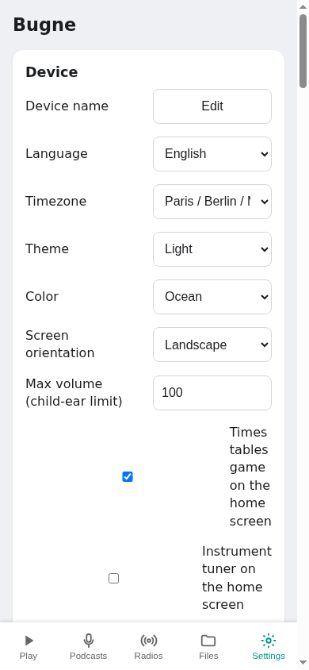

Everything else is here:

- Device name, language (English or French, for the device screen and for this
  page), and time zone.
- Theme, color and screen orientation of the device.
- Max volume: a hard ceiling for little ears. The device never plays louder,
  whatever a child, or anything else, asks for.
- Show or hide the game tile and the tuner tile (experimental).
- Alarms: the same three alarms as on the device.
- Quiet hours: up to two time windows, 20:30 to 07:00 for example. During a
  window the device plays nothing and the game does not open. The alarm still
  rings. This is useful at night and at homework time.
- Daily listening limit: a maximum time per day. The device counts the
  listening time and the time in the game. It warns the child 5 minutes before
  the limit, then refuses to play. The count survives a restart, and starts
  again at midnight. The child reads the time left on the device, under
  Settings, then "Listening time".
- Listening statistics: minutes per day and per source over the last week, and
  the most played titles. The data never leaves the device. You can erase it at
  any time.
- Home Assistant: the connection to your Home Assistant server (URL, Entity ID
  and a long-lived access token). It adds a Lamp tile (experimental feature) to
  the home screen of the device.
- Wi-Fi networks: add, edit or remove a saved network.
- Page password, backup and restore of the configuration, device logs, and
  firmware updates (see below). The Diagnostics card also has a "Crash report"
  button. If the device ever restarts by itself, that report shows what the
  firmware was doing at that moment, which is what a bug report needs.

Note: reload the web page after a firmware update, before you change a setting.

## 7. Going further

### Music Assistant and multiroom

Bugne appears by itself as a player in
[Music Assistant](https://music-assistant.io) on the same network. It speaks
the Sendspin protocol. You send music to it, you group it with other speakers,
and you control the volume from Music Assistant. The device screen shows what
plays. Pause, stop and volume also work on the device itself. A drag on the
progress bar moves through the track, when the Music Assistant server offers
that. The max volume ceiling still applies.

### Home Assistant

The device announces itself on the network with mDNS and serves a small HTTP
API for its status and its playback. You can integrate it into Home Assistant,
or into any home automation that calls HTTP endpoints. The README lists the
routes.

### Several Bugnes in one home

Each device has its own name, its own web address (`bugne-xxxx.local`) and its
own settings. They do not interfere with each other. Use Music Assistant for
synchronized playback in several rooms.

### Firmware updates

Open the Settings tab of the web page. Check for the latest release and install
it with one click, or upload a firmware file. The device restarts, so keep it
powered during the update. If a new firmware does not start, the device returns
to the previous one by itself.

## 8. Troubleshooting

- No Wi-Fi at a new place: wait about 30 seconds. The `Bugne-Setup-XXXX`
  hotspot comes back. Scan the QR code under Settings, then "Setup hotspot
  (QR)", and add the new network.
- Wi-Fi down: the SD card music, the library, the downloaded episodes, the game
  and the tuner keep working. The web radios and the episodes that are not
  downloaded stay grey until the connection returns.
- No SD card, or the device does not see it: the web radios and the podcast
  streaming still work. Re-seat the card. Use a card formatted in FAT32.
- No sound: check the volume slider, then the max volume ceiling on the web
  Settings tab, then make sure the quiet hours are not active.
- A web radio stopped by itself: the device retries a dropped stream for about
  two minutes. Start it again if it gave up.
- A file does not show, or the web page cannot download it: the device cuts a
  file name longer than 63 bytes. That is about 60 characters with accents.
  Rename that file on a computer.
- The device does not respond: unplug it, wait a few seconds, plug it back in.
  The settings survive.
- Forgotten page password: the device has no reset button. The person who built
  it clears the password with a USB flash and the `--erase` option, as in
  section 3. That also erases the saved Wi-Fi networks and the settings.
