# Mode d'emploi de la Bugne

[English version](en.md)

La Bugne est une petite boîte à musique tactile pour les enfants : radios
web, podcasts (aussi hors ligne), musique sur carte SD, réveil, jeu de
tables de multiplication et accordeur d'instrument. Les parents gèrent tout
depuis une page web sur leur téléphone ou ordinateur.

Ce mode d'emploi a cinq parties : la fabrication (la carte et son boîtier
imprimé en 3D), le flash du firmware, l'installation (pour les parents),
l'utilisation quotidienne (assez simple pour un enfant), et le coin des
parents (la page web, les alarmes, les heures calmes, les mises à jour).

## 1. Découvrir la Bugne

- Un écran couleur tactile de 2,8 pouces. Tout se fait en le touchant.
- Un haut-parleur en façade et un petit trou de micro (utilisé par
  l'accordeur).
- Un port USB sur le côté : il alimente l'appareil et charge la batterie
  interne.
- Un lecteur de carte microSD pour votre musique et les épisodes de
  podcasts enregistrés.
- Un bouton BOOT : vous n'en avez normalement jamais besoin.

Pour l'allumer : branchez-la ou utilisez l'interrupteur. L'écran d'accueil
apparaît en une seconde environ.

## 2. Le matériel : la carte et le boîtier imprimé en 3D

La Bugne se fabrique soi-même : une carte du commerce et un boîtier
imprimé en 3D.

- La carte est une **LCDWIKI ES3C28P** (référence exacte à respecter) :
  un ESP32-S3 avec 16 Mo de flash et 8 Mo de PSRAM, un écran tactile
  capacitif de 2,8 pouces, un codec audio, un micro, un lecteur microSD
  et un port USB. Le petit haut-parleur est livré avec la carte.
- La carte a aussi un port batterie avec chargeur (LiPo 3,7 V à une
  cellule, prise JST 1.25 mm). Le projet ne l'a pas encore testé, donc
  ce n'est pas conseillé pour l'instant : alimentez l'appareil par USB.
- Le boîtier s'imprime en 3D : le dossier `case/` du projet propose
  trois modèles. Un boîtier simple en deux pièces (portrait, son par une
  grille au dos), un poste « vieille radio » et un coffret « seventies »
  (tous deux en paysage, imprimés face contre le plateau sans supports ;
  leur grille de haut-parleur peut s'imprimer dans une seconde couleur).
  Le coffret seventies est le modèle conseillé. Quelques petites vis
  autotaraudeuses fixent la carte et ferment le dos.

## 3. Installer le firmware (premier flash)

Passez cette section si votre Bugne affiche déjà quelque chose à l'écran :
elle ne concerne qu'une carte fraîchement assemblée (ou une récupération
complète). Les mises à jour normales se font depuis la page web (voir
« Mises à jour du firmware » en section 7).

Il vous faut : un ordinateur avec Python installé et un câble USB de
données.

1. Installez esptool (l'outil de flash officiel d'Espressif) :
   `pip install esptool`.
2. Téléchargez `bugne-flash.zip` depuis la dernière version publiée sur
   <https://github.com/Tupile/bugne-releases/releases/latest> et
   décompressez-le.
3. Branchez la carte à l'ordinateur en USB.
4. Dans le dossier décompressé, lancez `./flash.sh --erase`
   (Linux/macOS). Sous Windows, lancez la commande `esptool` écrite dans
   `flash.sh`.
5. Si aucun port série n'est trouvé, maintenez le bouton BOOT en
   branchant le câble USB, puis relancez le script.

À la fin, l'appareil redémarre sous Bugne et ouvre son point d'accès
`Bugne-Setup-XXXX` : enchaînez avec la section suivante.

## 4. Première installation (parents)

Il vous faut : un réseau Wi-Fi 2,4 GHz, un téléphone, et si possible une
carte microSD (FAT32) avec de la musique.

1. Allumez l'appareil. Comme il ne connaît encore aucun réseau Wi-Fi, il
   ouvre son propre point d'accès et affiche un QR code.
2. Scannez le QR code avec votre téléphone. Il rejoint le point d'accès
   nommé `Bugne-Setup-XXXX` (le XXXX est propre à votre appareil, tout
   comme le mot de passe du point d'accès, contenu dans le QR code).
3. La page de configuration s'ouvre toute seule après la connexion (sinon,
   ouvrez `http://192.168.4.1` dans le navigateur du téléphone).
4. Sur cette page, choisissez votre réseau Wi-Fi et saisissez son mot de
   passe. L'appareil se connecte et le point d'accès disparaît.
5. La page de configuration est désormais disponible sur votre réseau, à
   l'adresse affichée sur l'appareil dans Réglages, puis "Page de config
   (QR)". Scannez ce QR code ou tapez l'adresse, de la forme
   `http://bugne-xxxx.local`.
6. Facultatif : insérez une carte microSD avec de la musique. Les dossiers
   et fichiers apparaissent sous la tuile Carte SD. Les fichiers MP3,
   FLAC, AAC (.m4a), Ogg Opus et Ogg Vorbis sont lus.
7. Facultatif mais recommandé : sur la page web, ouvrez Réglages et
   définissez un mot de passe de page, pour que les enfants ne puissent
   pas ouvrir les réglages parents depuis leurs propres appareils.

Vous pouvez enregistrer plusieurs réseaux Wi-Fi (maison, grands-parents,
...). L'appareil choisit le plus fort qu'il voit et change tout seul si
besoin. S'il ne joint aucun réseau connu pendant environ 30 secondes, le
point d'accès d'installation revient pour corriger la configuration.

## 5. Au quotidien

### L'écran d'accueil

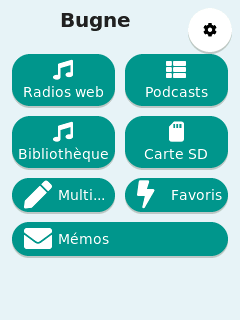

De grandes tuiles colorées : Radios web, Podcasts, Bibliothèque, Carte SD,
Mémos, et selon ce que les parents ont activé : Multiplications (le jeu),
Favoris, Accordeur, et Lampe. La roue dentée en haut à droite ouvre les
réglages. Quand rien ne joue et que l'heure est réglée, elle s'affiche en bas.

### Écouter la radio

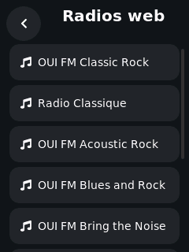

Touchez la tuile Radios web, puis une station. Elle démarre et l'écran de
lecture s'ouvre. Il faut le Wi-Fi : la tuile est grisée quand l'appareil
est hors ligne.

### Les podcasts

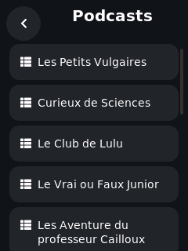 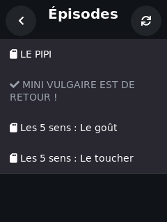

Touchez Podcasts, choisissez une émission, puis un épisode. La petite
icône devant chaque épisode indique comment il sera lu :

- Icône carte SD : l'épisode est enregistré sur la carte et se lit même
  sans Wi-Fi.
- Icône téléchargement : l'épisode sera lu en direct par le Wi-Fi. Sans
  Wi-Fi, ces lignes sont grisées.
- Ligne grise avec une coche : vous l'avez déjà écouté.

Le bouton aux flèches rondes en haut à droite actualise la liste des
épisodes depuis internet.

### Votre musique (Carte SD et Bibliothèque)

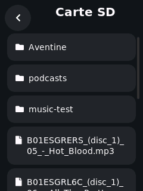 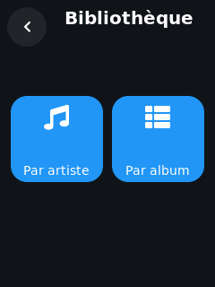

La tuile Carte SD parcourt la carte dossier par dossier. La tuile
Bibliothèque montre la même musique classée par artiste ou par album. Dans
un dossier ou un album, les boutons suivant et précédent passent d'un
morceau à l'autre.

### Les favoris

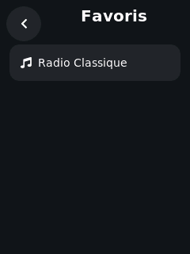

Pendant une écoute, touchez le bouton rond + de l'écran de lecture pour la
garder en favori (radios, morceaux et épisodes téléchargés, 12 au
maximum). La tuile Favoris les relance en un geste. Touchez le même bouton
(devenu un moins) pour retirer un favori.

### L'écran de lecture

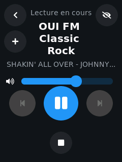

- Le grand bouton rond met en pause et reprend.
- Le petit bouton carré en dessous arrête.
- Précédent et suivant changent de morceau ou d'épisode (sans effet sur
  une radio).
- Le curseur règle le volume (les parents peuvent plafonner le maximum).
- Le bouton + ajoute ou retire un favori.
- Le bouton œil est la minuterie de sommeil : chaque appui passe de
  arrêté à 15, 30, 45, 60 minutes, puis "fin du morceau". La musique
  s'arrête toute seule au bout du temps choisi. Parfait pour le coucher.
- La flèche retour ramène aux menus pendant que la musique continue. Une
  petite barre en bas de chaque écran montre ce qui joue ; touchez-la pour
  revenir.

L'écran s'éteint tout seul au bout d'un moment ; la musique continue.
Touchez l'écran pour le rallumer.

### Le jeu des tables de multiplication

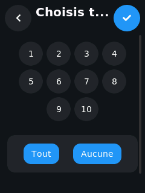 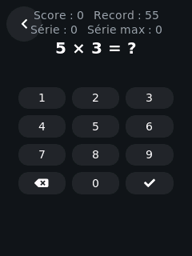

Touchez la tuile du jeu, choisissez les tables à réviser (ou Tout), puis
touchez le bouton coche. Répondez avec le clavier. Le score, le record et
la série sont en haut ; le record est mémorisé.

### L'accordeur

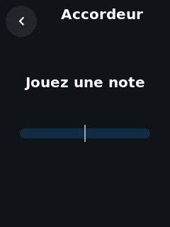

Ouvrez la tuile Accordeur et jouez une note près de l'appareil. L'écran
affiche le nom de la note, sa fréquence, et une barre qui indique si vous
êtes trop bas (à gauche) ou trop haut (à droite). Accordez jusqu'à centrer
la barre.

### La Lampe

Si vos parents l'ont configurée, une tuile Lampe apparaît sur l'écran d'accueil.
Touchez-la pour allumer ou éteindre la lumière de la chambre.

### Les mémos vocaux

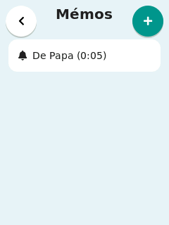 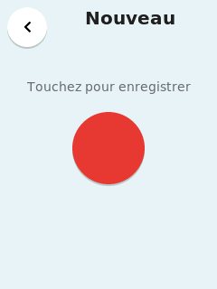

La tuile Mémos est une petite boîte vocale. Touchez le bouton +, puis le
grand bouton rouge, et parlez (jusqu'à une minute). Quand vous arrêtez,
vous pouvez écouter votre message, le garder sur l'appareil, l'envoyer à
une autre Bugne de la maison, ou le jeter.

Quand un mémo arrive, un petit point rouge apparaît sur la tuile Mémos et
un message s'affiche. Ouvrez la tuile et touchez la ligne avec la cloche
pour l'écouter ; le bouton poubelle supprime le mémo ouvert. L'envoi
demande le Wi-Fi et une autre Bugne sur le même réseau, et l'appareil
garde au plus 20 mémos. Les parents peuvent refuser la réception depuis la
page web (onglet Réglages) ; ce réglage coupe aussi le talkie-walkie
ci-dessous.

### Le talkie-walkie

Le bouton téléphone de l'écran Mémos ouvre le talkie-walkie. Choisissez
l'autre Bugne, puis maintenez le grand bouton rouge et parlez : le message
part tout seul quand vous relâchez, et il est joué aussitôt si l'autre
Bugne est elle aussi sur son écran talkie-walkie. Sinon, rien n'est perdu :
le message est déposé dans sa boîte à mémos. Les messages du talkie-walkie
ne sont pas conservés, et le curseur en bas règle le volume.

### Les réglages de l'appareil

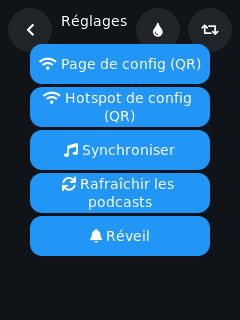 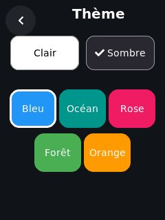

La roue dentée de l'accueil ouvre les réglages : les deux QR codes (page
de config et point d'accès d'installation), la synchronisation de la
bibliothèque, l'actualisation des podcasts et le réveil. Le bouton goutte
choisit le thème (clair ou sombre, cinq couleurs) ; le bouton boucle fait
pivoter l'écran entre portrait et paysage.

### Le réveil

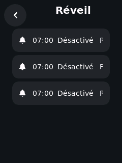

Jusqu'à trois alarmes. Pour chacune : activée ou non, l'heure, les jours
de la semaine, ce qu'elle joue (une radio web ou un morceau de la carte
SD) et son volume. Le son démarre doucement puis monte. Si la radio
choisie est injoignable, l'appareil bipe à la place : le réveil sonne
toujours. Pendant qu'il sonne, vous pouvez le répéter (10 minutes) ou
l'arrêter ; il s'arrête seul après 30 minutes. Les alarmes se règlent
aussi depuis la page web, et elles sonnent même pendant les heures calmes.

## 6. Le coin des parents : la page web

Ouvrez `http://bugne-xxxx.local` (ou scannez le QR dans Réglages, puis
"Page de config (QR)") depuis un téléphone ou un ordinateur sur le même
Wi-Fi. Si vous avez défini un mot de passe de page, connectez-vous
d'abord. Cinq onglets en bas (ou en haut sur ordinateur).

### Lecture

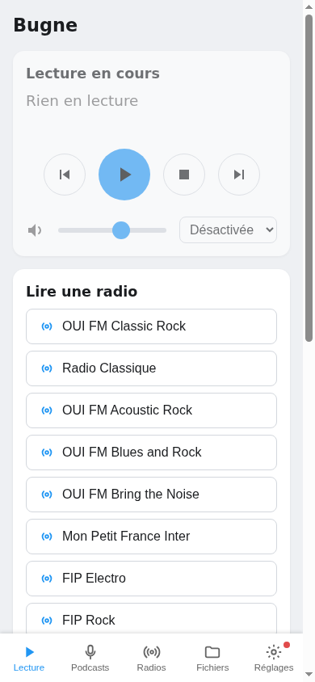

Une télécommande : voir ce qui joue, mettre en pause, arrêter, passer au
suivant, changer le volume, régler la minuterie de sommeil, et lancer
n'importe quelle radio ou morceau de la bibliothèque.

### Podcasts

Ajoutez un podcast avec l'URL de son flux RSS. Le champ des secondes
d'intro coupe les N premières secondes de chaque épisode (jingles,
sponsors). "Télécharger nouveaux" enregistre les nouveaux épisodes sur la
carte SD pour l'écoute hors ligne ; les téléchargements tournent quand
l'appareil est inactif et se mettent en pause dès qu'un enfant lance une
écoute. L'appareil actualise aussi les flux et télécharge les nouveautés
tout seul quand il est resté inactif un moment.

### Radios

Cherchez dans l'annuaire public radio-browser.info et ajoutez une station
en un clic, ou ajoutez-la à la main avec son nom et l'URL directe du flux.
"Passer la pub" coupe le son de la publicité que certaines stations
diffusent à l'ouverture.

### Fichiers

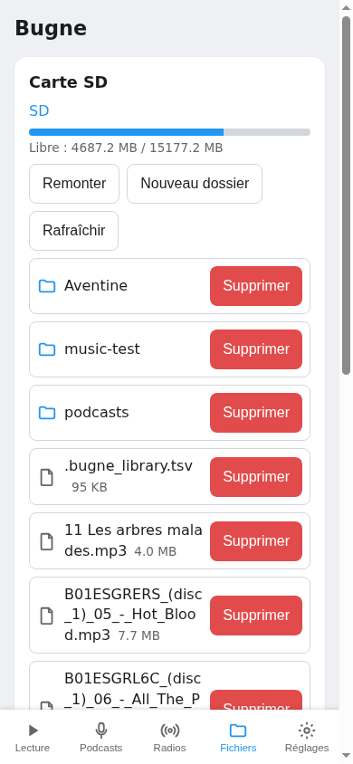

Parcourez la carte SD, vérifiez l'espace libre, créez des dossiers,
supprimez des fichiers.

### Réglages

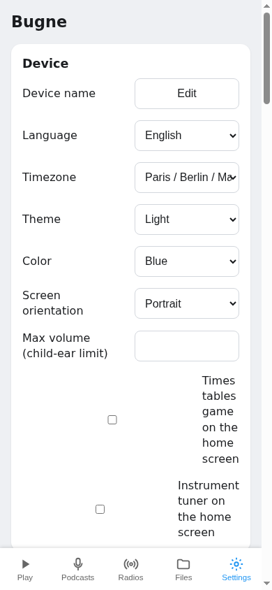

Tout le reste est ici :

- Nom de l'appareil, langue (français ou anglais : l'écran de l'appareil
  et cette page la suivent), fuseau horaire.
- Thème, couleur et orientation de l'écran de l'appareil.
- Volume maximum : un plafond absolu pour les petites oreilles. Quoi que
  demande un enfant (ou autre chose), l'appareil ne joue jamais plus fort.
- Afficher ou masquer les tuiles du jeu et de l'accordeur.
- Alarmes : les trois mêmes alarmes que sur l'appareil.
- Heures calmes : jusqu'à deux plages horaires (par exemple 20h30 à 7h00)
  pendant lesquelles rien ne peut être lancé et le jeu ne s'ouvre pas. Le
  réveil sonne quand même. Pratique pour la nuit et les devoirs.
- Statistiques d'écoute : minutes écoutées par jour et par source sur la
  dernière semaine, et les titres les plus écoutés. Les données ne
  quittent jamais l'appareil et peuvent être remises à zéro à tout moment.
- Home Assistant : configurez une connexion à votre serveur Home Assistant
  (URL, Entité, et un Jeton d'accès longue durée) pour ajouter une tuile
  Lampe sur l'écran d'accueil de l'appareil.
- Réseaux Wi-Fi : ajouter, modifier ou supprimer les réseaux enregistrés.
- Mot de passe de la page, sauvegarde et restauration de la configuration,
  journaux de l'appareil, et mises à jour du firmware (voir plus bas).

Remarque : après une mise à jour du firmware, rechargez la page web avant
de modifier des réglages.

## 7. Pour aller plus loin

### Music Assistant et multiroom

La Bugne apparaît automatiquement comme lecteur dans
[Music Assistant](https://music-assistant.io) sur le même réseau (elle
parle le protocole Sendspin). Vous pouvez lui envoyer de la musique, la
grouper avec d'autres enceintes et régler le volume depuis Music
Assistant. L'écran de l'appareil montre ce qui joue ; pause, arrêt et
volume marchent aussi sur l'appareil. Le plafond de volume s'applique
toujours.

### Home Assistant

L'appareil s'annonce sur le réseau (mDNS) et offre une petite API HTTP
(état, commandes de lecture) : il peut donc s'intégrer à Home Assistant ou
à toute domotique capable d'appeler des adresses HTTP.

### Plusieurs Bugnes à la maison

Chaque appareil a son nom, sa propre adresse web (`bugne-xxxx.local`) et
ses propres réglages. Ils ne se gênent pas ; utilisez Music Assistant pour
une lecture synchronisée dans plusieurs pièces.

### Mises à jour du firmware

Dans l'onglet Réglages de la page web : vérifiez la dernière version et
installez-la en un clic, ou envoyez un fichier de firmware. L'appareil
redémarre, laissez-le branché pendant la mise à jour. Si un nouveau
firmware ne démarre pas, l'appareil revient automatiquement au précédent.

## 8. Dépannage

- Pas de Wi-Fi dans un nouveau lieu : attendez environ 30 secondes, le
  point d'accès `Bugne-Setup-XXXX` apparaît. Scannez le QR dans Réglages,
  puis "Hotspot de config (QR)" et ajoutez le nouveau réseau.
- Hors ligne (Wi-Fi coupé) : la musique SD, la bibliothèque, les épisodes
  téléchargés, le jeu et l'accordeur continuent de marcher. Les radios et
  les épisodes non téléchargés sont grisés jusqu'au retour de la
  connexion.
- Pas de carte SD (ou non détectée) : les radios et le streaming de
  podcasts marchent quand même. Réinsérez la carte ; utilisez une carte
  formatée en FAT32.
- Pas de son : vérifiez le curseur de volume, puis le volume maximum
  (Réglages web), et que les heures calmes ne sont pas actives.
- Une radio s'est arrêtée toute seule : l'appareil retente un flux coupé
  pendant environ deux minutes avant d'abandonner. S'il a abandonné,
  relancez-la simplement.
- L'appareil ne répond plus : débranchez-le, attendez quelques secondes,
  rebranchez-le. Les réglages sont conservés.
- Mot de passe de page oublié : il n'y a pas de bouton de réinitialisation
  sur l'appareil. La personne qui l'a assemblé peut l'effacer en
  reflashant par USB avec `--erase`, comme en section 3 (les réseaux
  Wi-Fi et réglages enregistrés sont effacés aussi).
