# Mode d'emploi de la Bugne

[English version](en.md)

La Bugne est une petite boîte à musique tactile pour les enfants. Elle joue des
radios web, des podcasts (aussi hors ligne) et la musique d'une carte SD. Elle
a aussi un réveil, des mémos vocaux, un jeu de tables de multiplication et un
accordeur d'instrument (expérimental). Les parents gèrent tout depuis une page
web, sur leur téléphone ou leur ordinateur.

Ce mode d'emploi a cinq parties :

- La fabrication : la carte et son boîtier imprimé en 3D.
- Le flash du firmware.
- L'installation, pour les parents.
- L'utilisation quotidienne, assez simple pour un enfant.
- Le coin des parents : la page web, les alarmes, les heures calmes et les
  mises à jour.

## 1. Découvrir la Bugne

- Un écran couleur tactile de 2,8 pouces. Tout se fait en le touchant.
- Un haut-parleur en façade et un petit trou de micro. L'accordeur et les mémos
  vocaux utilisent ce micro.
- Un port USB sur le côté. Il alimente l'appareil et charge la batterie.
- Un lecteur de carte microSD pour votre musique et les épisodes de
  podcasts enregistrés. Si vous en avez besoin, vous pouvez en trouver [ici](https://s.click.aliexpress.com/e/_c2yej75h)
  ou [ici](https://s.click.aliexpress.com/e/_c3ywvSmJ) (pour les utilisateurs en France,
  vous pouvez aussi utiliser ce [lien affilié Amazon](https://amzn.to/3Ta5I6J)).
- Un bouton BOOT. Vous n'en avez normalement jamais besoin.

Pour l'allumer, branchez-la ou utilisez l'interrupteur. L'écran d'accueil
apparaît en une seconde environ.

## 2. Le matériel : la carte et le boîtier imprimé en 3D

La Bugne se fabrique soi-même. Vous achetez une carte du commerce et vous
imprimez un boîtier.

- La carte est une **LCDWIKI ES3C28P**. Respectez cette référence exacte. C'est
  un ESP32-S3 avec 16 Mo de flash et 8 Mo de PSRAM, un écran tactile
  capacitif de 2,8 pouces, un codec audio, un micro, un lecteur microSD
  et un port USB. Le petit haut-parleur est livré avec la carte. Si vous
  souhaitez m'aider sans coût supplémentaire, vous pouvez la commander via ce
  [lien affilié Aliexpress](https://s.click.aliexpress.com/e/_c4OZeS8F)
  (ou ce [lien alternatif](https://s.click.aliexpress.com/e/_c3MmlBCJ) en
  cas d'indisponibilité) en vous assurant de sélectionner le modèle touch
  "ES3C28P". Pour les utilisateurs basés en France, vous pouvez également
  utiliser ce [lien affilié Amazon](https://amzn.to/3RrzKT1).
- La carte a aussi un port batterie avec chargeur, pour un accu LiPo 3,7 V à
  une cellule, prise JST 1.25 mm. Le projet ne l'a pas encore testé et ne le
  conseille pas pour l'instant. Alimentez l'appareil par USB.
- Le boîtier s'imprime en 3D. Le dossier `case/` du projet propose trois
  modèles, également disponibles pour les imprimantes BambuLab sur
  [MakerWorld](https://makerworld.com/en/models/3073793-bugne-open-source-internet-radio-podcast-player).
  Le premier est un boîtier simple en deux pièces : portrait, avec le son par
  une grille au dos. Les deux autres sont un poste « vieille radio » et un
  coffret « seventies » : en paysage, imprimés face contre le plateau sans
  supports. Leur grille de haut-parleur accepte une seconde couleur. Le coffret
  seventies est le modèle conseillé. De petites vis fixent la carte et ferment
  le dos : 4 vis M3 de 6 mm pour la carte et 4 vis M3 de 10 mm pour le capot,
  disponibles [ici](https://s.click.aliexpress.com/e/_c34zawnh).

## 3. Installer le firmware (premier flash)

Passez cette section si votre Bugne affiche déjà quelque chose à l'écran. Elle
ne concerne qu'une carte neuve, ou une récupération complète. Les mises à jour
normales s'installent depuis la page web. Voir « Mises à jour du firmware » en
section 7.

Il vous faut un ordinateur et un câble USB de données.

1. Branchez la carte à votre ordinateur en USB. Maintenez le bouton BOOT appuyé
   pendant que vous branchez le câble, pour passer en mode bootloader.
2. Ouvrez la page de l'[Installateur Web](https://tupile.github.io/bugne-releases/tools/web-flasher/)
   avec Chrome, Edge ou Opera.
3. Cliquez sur "Installer", choisissez le port COM de la carte, et patientez
   jusqu'à la fin de l'installation.

*(Pour un usage hors ligne : téléchargez `bugne-flash.zip` depuis la
[dernière release](https://github.com/Tupile/bugne-releases/releases/latest),
installez `esptool`, puis lancez le script `flash.sh` fourni.)*

À la fin, l'appareil redémarre sous Bugne et ouvre son point d'accès
`Bugne-Setup-XXXX`. Enchaînez avec la section suivante.

## 4. Première installation (parents)

Il vous faut un réseau Wi-Fi 2,4 GHz et un téléphone. Une carte microSD (FAT32)
avec de la musique est facultative.

1. Allumez l'appareil. Il ne connaît encore aucun réseau Wi-Fi, donc il ouvre
   son propre point d'accès et affiche un QR code.
2. Scannez ce QR code avec votre téléphone. Votre téléphone rejoint le point
   d'accès `Bugne-Setup-XXXX`. Le XXXX est propre à votre appareil, tout comme
   le mot de passe du point d'accès, que le QR code contient.
3. La page web s'ouvre toute seule après la connexion. Sinon, ouvrez
   `http://192.168.4.1` dans le navigateur du téléphone.
4. Sur cette page, choisissez votre réseau Wi-Fi et saisissez son mot de passe.
   L'appareil se connecte et le point d'accès s'arrête.
5. La page web est maintenant sur votre réseau. L'appareil affiche son adresse
   dans Réglages, puis « Page de config (QR) ». Scannez ce QR code, ou tapez
   l'adresse, de la forme `http://bugne-xxxx.local`.
6. Facultatif : insérez une carte microSD avec de la musique. Les dossiers et
   les fichiers apparaissent alors sous la tuile Carte SD. L'appareil lit les
   fichiers MP3, FLAC, AAC (.m4a), Ogg Opus et Ogg Vorbis. Vous pouvez
   insérer ou retirer la carte à tout moment, l'appareil allumé : il le
   remarque tout seul en une demi-minute environ, sans redémarrage.
7. Facultatif mais recommandé : sur la page web, ouvrez Réglages et définissez
   un mot de passe de page. Un enfant ne pourra alors pas ouvrir les réglages
   parents depuis son propre téléphone.

Vous pouvez enregistrer plusieurs réseaux Wi-Fi : maison, grands-parents, et
ainsi de suite. L'appareil rejoint le plus fort qu'il voit, et change de réseau
tout seul quand il le faut. S'il ne joint aucun réseau connu pendant environ
30 secondes, le point d'accès d'installation revient, pour que vous corrigiez
la configuration.

## 5. Au quotidien

### L'écran d'accueil

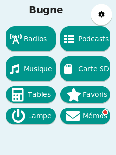

L'écran d'accueil affiche de grandes tuiles colorées : Radios web, Podcasts,
Bibliothèque, Carte SD et Mémos. Quatre autres tuiles apparaissent quand les
parents les activent : Multiplications (le jeu), Favoris, Accordeur
(expérimental) et Lampe (expérimentale). La roue dentée en haut à droite ouvre
les réglages. L'heure s'affiche en bas quand rien ne joue et que l'heure est
réglée.

### Écouter la radio

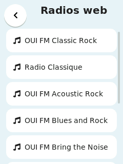

Touchez la tuile Radios web, puis une station. Elle démarre et l'écran de
lecture s'ouvre. Il faut le Wi-Fi : la tuile est grisée quand l'appareil est
hors ligne.

### Les podcasts

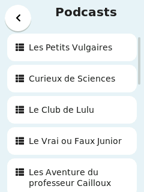 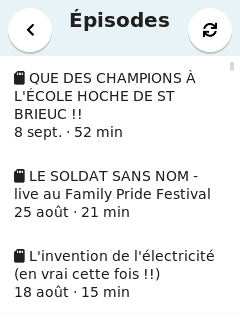

Touchez Podcasts, choisissez une émission, puis un épisode. La petite icône
devant chaque épisode indique comment il sera lu :

- Icône carte SD : l'épisode est sur la carte. Il se lit sans Wi-Fi.
- Icône téléchargement : l'épisode sera lu en direct par le Wi-Fi. Ces lignes
  sont grisées quand l'appareil est hors ligne.
- Ligne grise avec une coche : vous l'avez déjà écouté.

Le bouton aux flèches rondes en haut à droite actualise la liste des épisodes
depuis internet.

### Votre musique (Carte SD et Bibliothèque)

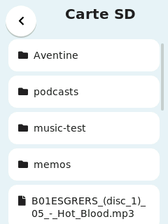 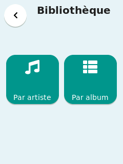

La tuile Carte SD parcourt la carte dossier par dossier. La tuile Bibliothèque
montre la même musique, classée par artiste ou par album. Dans un dossier ou un
album, les boutons suivant et précédent passent d'un morceau à l'autre.

### Les favoris

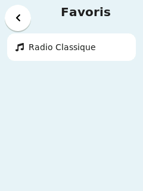

Pendant une écoute, touchez le bouton rond + de l'écran de lecture pour la
garder en favori. Les radios web, les morceaux et les épisodes téléchargés
peuvent être des favoris, 12 au maximum. La tuile Favoris les relance en un
geste. Pour retirer un favori, touchez le même bouton, devenu un moins.

### L'écran de lecture

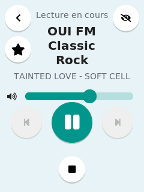

- Le grand bouton rond met en pause et reprend.
- Le petit bouton carré en dessous arrête.
- Précédent et suivant changent de morceau ou d'épisode. Ils n'ont pas d'effet
  sur une radio web.
- Le curseur règle le volume. Les parents peuvent plafonner le maximum.
- Le bouton + ajoute ou retire un favori.
- Le bouton œil est la minuterie de sommeil. Chaque appui passe à la valeur
  suivante : arrêté, 15, 30, 45, 60 minutes, puis « fin de piste ». La
  musique s'arrête toute seule au bout du temps choisi. C'est pratique au
  coucher.
- La flèche retour ramène aux menus et la musique continue. Une petite barre en
  bas de chaque écran montre ce qui joue. Touchez cette barre pour revenir.

En paysage, l'écran affiche aussi la pochette, à gauche du titre. L'appareil
lit l'image contenue dans le fichier MP3 ou FLAC. Pour un podcast, il utilise
l'image du flux. Une radio web n'a pas de pochette.

L'écran s'éteint tout seul au bout d'un moment, et la musique continue. Touchez
l'écran pour le rallumer.

### Le jeu des tables de multiplication

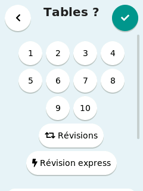 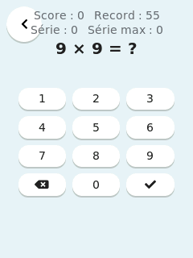

Touchez la tuile du jeu. Sur l'écran de choix, sélectionnez les tables à
réviser, ou touchez Tout. Touchez ensuite le bouton coche en haut à droite.
Répondez avec le clavier. Le score, le record et la série sont en haut.
L'appareil garde le record.

Le même écran de choix propose deux autres pastilles :

- « Révisions » : l'appareil choisit les questions pour vous. Il pose plus
  souvent les multiplications que vous ratez, et moins souvent celles que vous
  savez. Chaque bonne réponse du premier coup fait avancer une multiplication
  d'un cran, jusqu'à cinq crans. Une mauvaise réponse la ramène au premier
  cran. L'en-tête affiche « Acquis : n/100 » à la place du score, où 100 est le
  nombre de multiplications de 1x1 à 10x10.
- « Révision express » : la même révision, en une session de 20 questions. Un
  seul appui la lance, sans choisir de table. L'en-tête compte les questions. À
  la fin, l'appareil enregistre vos progrès et affiche
  « Session terminée ! Bravo ! ».

L'appareil garde les progrès de révision d'une session à l'autre.

### L'accordeur (expérimental)

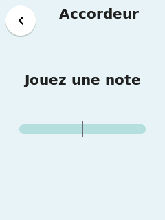

Ouvrez la tuile Accordeur et jouez une note près de l'appareil. L'écran affiche
le nom de la note, sa fréquence, et une barre. La barre indique si vous êtes
trop bas (à gauche) ou trop haut (à droite). Accordez jusqu'à centrer la barre.
*(Note : l'accordeur est une fonctionnalité expérimentale.)*

### La Lampe (expérimentale)

Une tuile Lampe apparaît sur l'écran d'accueil quand vos parents la
configurent. Elle commande un éclairage via Home Assistant (fonctionnalité
expérimentale). Touchez-la pour allumer ou éteindre la lumière de la chambre.

### Les mémos vocaux

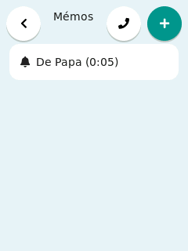 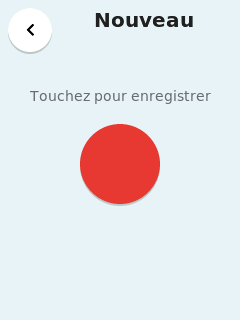

La tuile Mémos est une petite boîte vocale. Touchez le bouton +, puis le grand
bouton rouge, et parlez. Un mémo dure une minute au maximum. Quand vous
arrêtez, vous pouvez écouter votre message, le garder sur l'appareil, l'envoyer
à une autre Bugne de la maison, ou le supprimer.

Quand un mémo arrive, un petit point rouge apparaît sur la tuile Mémos et un
message s'affiche. Ouvrez la tuile et touchez la ligne avec la cloche pour
l'écouter. Le bouton poubelle supprime le mémo ouvert. L'envoi demande le Wi-Fi
et une autre Bugne sur le même réseau. L'appareil garde 20 mémos au maximum.
Les parents refusent la réception depuis la page web, dans l'onglet Réglages.
Ce même réglage coupe aussi le talkie-walkie ci-dessous.

### Le talkie-walkie

Le bouton téléphone de l'écran Mémos ouvre le talkie-walkie. Choisissez l'autre
Bugne, puis maintenez le grand bouton rouge et parlez. Le message part tout
seul quand vous relâchez. Il est joué aussitôt si l'autre Bugne est elle aussi
sur son écran talkie-walkie. Sinon, rien n'est perdu : le message est déposé
dans sa boîte à mémos. L'appareil ne conserve pas les messages du
talkie-walkie. Le curseur en bas règle le volume.

### Les réglages de l'appareil

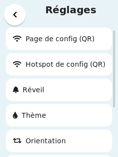 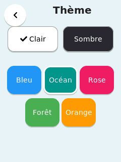

La roue dentée de l'accueil ouvre les réglages. Ils comptent sept lignes :

- « Page de config (QR) » : le QR code de l'adresse de la page web.
- « Hotspot de config (QR) » : le QR code qui rejoint le point d'accès
  d'installation.
- « Réveil » : les trois alarmes. Voir ci-dessous.
- « Thème » : clair ou sombre, et cinq couleurs.
- « Orientation » : chaque appui passe du portrait au paysage.
- « Temps d'écoute » : le temps compté aujourd'hui. Avec une limite
  quotidienne, l'écran affiche aussi une barre, le temps utilisé face à la
  limite, et le temps qui reste. Un enfant peut ouvrir cet écran à tout moment,
  même quand la limite est atteinte.
- « Mise à jour » : vérifie sur GitHub si une nouvelle version du firmware
  existe et propose de l'installer. Un point rouge marque cette ligne quand une
  mise à jour est déjà connue. L'installation demande une confirmation,
  arrête la lecture et redémarre l'appareil.

La bibliothèque musicale et les flux de podcast se mettent à jour tout seuls.
L'appareil fait ce travail quand personne ne l'utilise.

### Le réveil

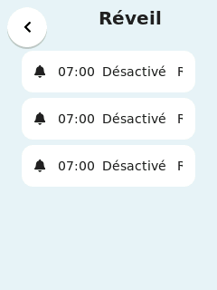

Vous pouvez régler trois alarmes. Pour chacune, vous choisissez : activée ou
non, l'heure, les jours de la semaine, ce qu'elle joue, et son volume. La
sonnerie se choisit dans un menu déroulant : vos favoris d'abord, puis le
morceau de carte SD choisi sur la page web, puis toutes les radios web. Choisir
un favori copie son contenu dans l'alarme : elle continue de le jouer même si
le favori change plus tard. Le son démarre
doucement et monte sur une minute. Une alarme peut aussi allumer l'écran
quelques minutes avant de sonner, comme un lever de soleil. Si l'appareil ne
joint pas la radio choisie, il bipe à la place : le réveil sonne toujours.
Pendant qu'il sonne, vous le répétez pour 10 minutes ou vous l'arrêtez. Il
s'arrête seul après 30 minutes. Les alarmes se règlent aussi depuis la page
web, et elles sonnent aussi pendant les heures calmes.

## 6. Le coin des parents : la page web

Ouvrez `http://bugne-xxxx.local` depuis un téléphone ou un ordinateur sur le
même Wi-Fi. Vous pouvez aussi scanner le QR code affiché sur l'appareil dans
Réglages, puis « Page de config (QR) ». Connectez-vous d'abord si vous avez
défini un mot de passe de page. La page a cinq onglets : en bas sur un
téléphone, en haut sur un ordinateur.

### Lecture

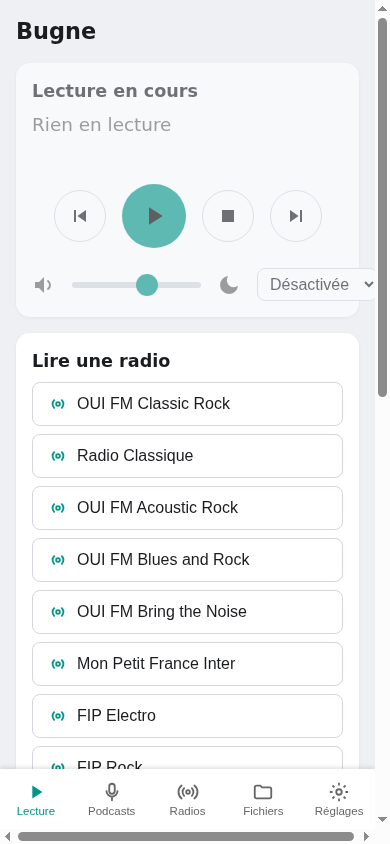

Cet onglet est une télécommande. Vous voyez ce qui joue. Vous mettez en pause,
vous arrêtez, vous passez au suivant, vous changez le volume et vous réglez la
minuterie de sommeil. Vous lancez aussi n'importe quelle radio web, ou
n'importe quel morceau de la bibliothèque.

### Podcasts

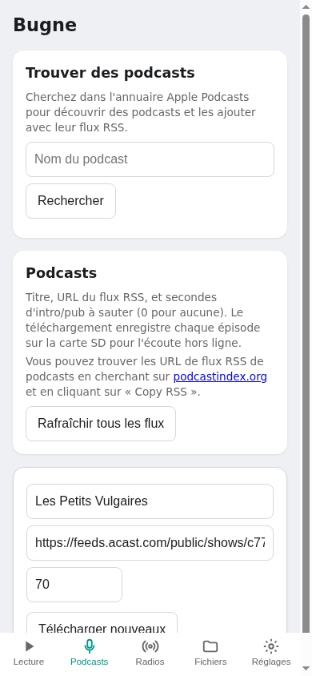

Le cadre « Trouver des podcasts » cherche dans l'annuaire Apple Podcasts.
Tapez un nom, puis ajoutez l'un des résultats en un clic : la page remplit
toute seule le titre et l'adresse RSS. Vous pouvez aussi ajouter une émission
à la main : collez l'adresse de son flux RSS dans le champ ci-dessous. La page
refuse d'enregistrer un podcast sans URL de flux RSS.

La carte « Calage du saut d'intro / de pub » joue le dernier épisode d'une
émission dans votre navigateur. Mettez en pause quand l'intro ou la partie
sponsor se termine, et le bouton règle les secondes à sauter pour cette
émission. Chaque podcast enregistré a aussi un bouton « Tester le saut » qui
ouvre le même lecteur, pour vérifier ou ajuster la valeur plus tard.

Le champ des secondes d'intro coupe les N premières secondes de chaque épisode,
pour un jingle de sponsor. « Télécharger nouveaux » enregistre les nouveaux
épisodes sur la carte SD pour l'écoute hors ligne. Un téléchargement tourne
quand personne n'utilise l'appareil, et se met en pause dès qu'un enfant lance
une écoute. L'appareil actualise aussi les flux et télécharge les nouveautés
tout seul, quand il est resté inactif un moment.

### Radios

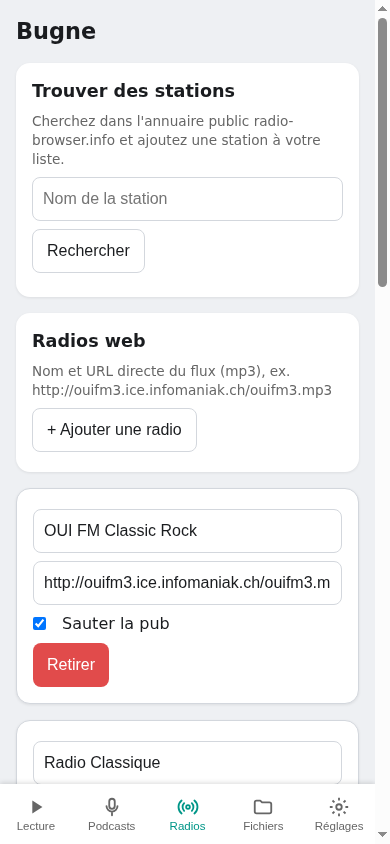

Cherchez dans l'annuaire public radio-browser.info et ajoutez une station en un
clic. Vous pouvez aussi ajouter une station à la main, avec son nom et l'URL de
son flux. La page refuse d'enregistrer une station sans URL de flux. « Sauter
la pub » supprime la publicité que certaines stations diffusent à l'ouverture.

### Fichiers

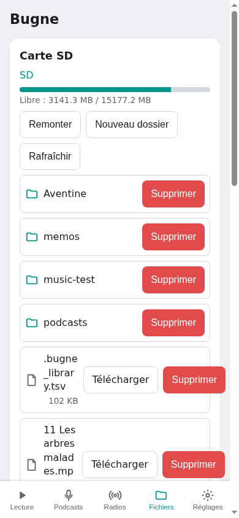

Parcourez la carte SD, consultez l'espace libre, créez des dossiers, envoyez
des fichiers, téléchargez des fichiers et supprimez des fichiers.

### Réglages

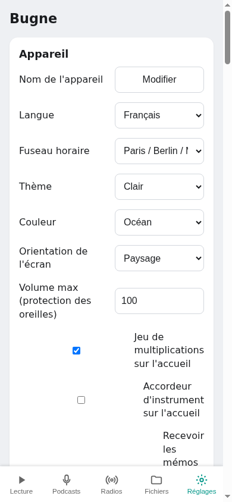

Tout le reste est ici :

- Nom de l'appareil, langue (français ou anglais, pour l'écran de l'appareil et
  pour cette page), et fuseau horaire.
- Thème, couleur et orientation de l'écran de l'appareil.
- Volume maximum : un plafond absolu pour les petites oreilles. L'appareil ne
  joue jamais plus fort, quoi que demandent un enfant ou autre chose.
- Afficher ou masquer la tuile du jeu et la tuile de l'accordeur
  (expérimental).
- Alarmes : les trois mêmes alarmes que sur l'appareil.
- Heures calmes : jusqu'à deux plages horaires, par exemple 20h30 à 7h00.
  Pendant une plage, l'appareil ne joue rien et le jeu ne s'ouvre pas. Le
  réveil sonne quand même. C'est pratique pour la nuit et les devoirs.
- Limite d'écoute quotidienne : un temps maximum par jour. L'appareil compte le
  temps d'écoute et le temps passé dans le jeu. Il prévient l'enfant 5 minutes
  avant la limite, puis refuse de jouer. Le compteur survit à un redémarrage,
  et repart à minuit. L'enfant lit le temps qui lui reste sur l'appareil, dans
  Réglages, puis « Temps d'écoute ».
- Statistiques d'écoute : minutes par jour et par source sur la dernière
  semaine, et les titres les plus écoutés. Les données ne quittent jamais
  l'appareil. Vous pouvez les remettre à zéro à tout moment.
- Home Assistant : la connexion à votre serveur Home Assistant (URL, Entité et
  un jeton d'accès longue durée). Elle ajoute une tuile Lampe (fonctionnalité
  expérimentale) sur l'écran d'accueil de l'appareil.
- Réseaux Wi-Fi : ajouter, modifier ou supprimer un réseau enregistré.
- Mot de passe de la page, sauvegarde et restauration de la configuration,
  journaux de l'appareil, et mises à jour du firmware (voir plus bas). La carte
  Diagnostics propose aussi un bouton « Rapport de plantage ». Si l'appareil
  redémarre tout seul, ce rapport indique ce que le firmware faisait à cet
  instant, ce qu'il faut justement pour un rapport de bug.

Remarque : rechargez la page web après une mise à jour du firmware, avant de
modifier un réglage.

## 7. Pour aller plus loin

### Music Assistant et multiroom

La Bugne apparaît toute seule comme lecteur dans
[Music Assistant](https://music-assistant.io) sur le même réseau. Elle parle le
protocole Sendspin. Vous lui envoyez de la musique, vous la groupez avec
d'autres enceintes et vous réglez le volume depuis Music Assistant. L'écran de
l'appareil montre ce qui joue. La pause, l'arrêt et le volume marchent aussi
sur l'appareil. Un glissement sur la barre de progression déplace la lecture,
quand le serveur Music Assistant le propose. Le plafond de volume s'applique
toujours.

### Home Assistant

L'appareil s'annonce sur le réseau avec mDNS et sert une petite API HTTP, pour
son état et sa lecture. Vous pouvez donc l'intégrer à Home Assistant, ou à
toute domotique capable d'appeler des adresses HTTP. Le README liste les
routes.

### Plusieurs Bugnes à la maison

Chaque appareil a son nom, sa propre adresse web (`bugne-xxxx.local`) et ses
propres réglages. Ils ne se gênent pas. Utilisez Music Assistant pour une
lecture synchronisée dans plusieurs pièces.

### Mises à jour du firmware

Ouvrez l'onglet Réglages de la page web. Vérifiez la dernière version et
installez-la en un clic, ou envoyez un fichier de firmware. L'appareil
redémarre, donc laissez-le branché pendant la mise à jour. Si un nouveau
firmware ne démarre pas, l'appareil revient tout seul au précédent.

## 8. Dépannage

- Pas de Wi-Fi dans un nouveau lieu : attendez environ 30 secondes. Le point
  d'accès `Bugne-Setup-XXXX` revient. Scannez le QR code dans Réglages, puis
  « Hotspot de config (QR) », et ajoutez le nouveau réseau.
- Wi-Fi coupé : la musique de la carte SD, la bibliothèque, les épisodes
  téléchargés, le jeu et l'accordeur continuent de marcher. Les radios web et
  les épisodes non téléchargés restent grisés jusqu'au retour de la connexion.
- Pas de carte SD, ou l'appareil ne la voit pas : les radios web et le
  streaming de podcasts marchent quand même. Réinsérez la carte ; l'appareil
  revérifie le lecteur tout seul, sans redémarrage. Utilisez une carte
  formatée en FAT32.
- Pas de son : vérifiez le curseur de volume, puis le volume maximum dans
  l'onglet Réglages de la page web, puis que les heures calmes ne sont pas
  actives.
- Une radio web s'est arrêtée toute seule : l'appareil retente un flux coupé
  pendant environ deux minutes. Relancez-la s'il a abandonné.
- Un fichier n'apparaît pas, ou la page web n'arrive pas à le télécharger :
  l'appareil coupe un nom de fichier plus long que 63 octets, soit environ
  60 caractères avec des accents. Renommez ce fichier sur un ordinateur.
- L'appareil ne répond plus : débranchez-le, attendez quelques secondes,
  rebranchez-le. Les réglages sont conservés.
- Mot de passe de page oublié : l'appareil n'a pas de bouton de
  réinitialisation. La personne qui l'a assemblé efface le mot de passe avec un
  flash USB et l'option `--erase`, comme en section 3. Cela efface aussi les
  réseaux Wi-Fi et les réglages enregistrés.
