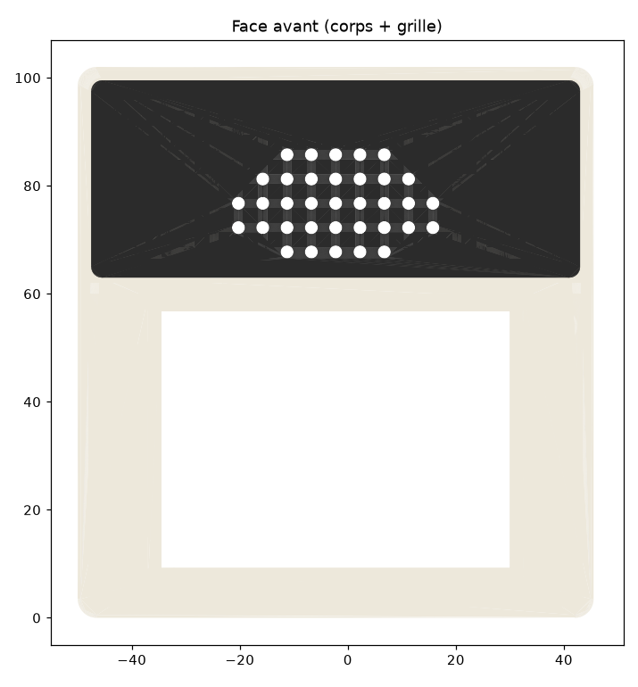

# Bugne quick start

[Version française](quickstart_fr.md)

From an empty desk to a kid listening to their first radio, in five steps:
buy one board, print a case, flash the firmware once, connect it to Wi-Fi,
add radios and podcasts. The full documentation lives in this repository;
each step below links to the relevant part.

## 1. What to buy

- The board: an **LCDWIKI ES3C28P** (use that exact reference). It is an
  ESP32-S3 with 16 MB flash and 8 MB PSRAM, a 2.8 inch capacitive touch
  screen, an audio codec, a microphone, a microSD slot and a USB port.
  The small speaker comes with the board. Nothing to solder. If you wish to
  support the project at no extra cost, you can order the board via this
  [Aliexpress affiliate link](https://s.click.aliexpress.com/e/_c4OZeS8F)
  (or this [alternative link](https://s.click.aliexpress.com/e/_c3MmlBCJ)
  if unavailable). Make sure to select the touch model "ES3C28P". For users
  in France, you can also use this [Amazon affiliate link](https://amzn.to/3RrzKT1).
- A USB data cable and a computer (for the first flash only).
- 4x M3 6mm screws to mount the board to the case, and 4x M3 10mm screws
  to close the case cover. If you don't have them, you can find them
  [here](https://s.click.aliexpress.com/e/_c34zawnh).
- Optional: a microSD card (FAT32) for your own music and offline podcast
  episodes (like [this one](https://s.click.aliexpress.com/e/_c2yej75h) or
  [this one](https://s.click.aliexpress.com/e/_c3ywvSmJ); for users in France,
  you can also use this [Amazon affiliate link](https://amzn.to/3Ta5I6J)).
- The board has a battery port and charger (single-cell 3.7 V LiPo), but
  battery operation is untested by the project so far and not recommended
  yet: power the device over USB.

## 2. What to 3D print: the seventies cabinet

Print the three parts of the seventies cabinet from the [`case/`](../case)
folder:

- `es3c28p_seventies_corps.stl` (body)
- `es3c28p_seventies_capot.stl` (rear cover)
- `es3c28p_seventies_grille.stl` (speaker grille)

It prints face down (front on the bed) with no supports. On a multi-color
printer, use `es3c28p_seventies_corps+grille.step` to print the grille
plate in a second color; a single color works too.

If you don't have a 3D printer, services like PCBWay or Craftcloud can print
and deliver the case to you. For the seventies model, you should order
`es3c28p_seventies_corps+grille.step` and `es3c28p_seventies_capot.stl`
printed in PLA.

Two alternative designs (a plain two-piece case and a vintage radio
cabinet) live in the same [`case/`](../case) folder, along with the
CadQuery scripts that generate all of them.

## 3. Flash the firmware (USB, once)

A brand-new board needs one full flash over USB. All later updates install
over Wi-Fi from the web page, no cable needed.

1. Connect the board to your computer over USB.
2. Open the [Web Flasher](https://tupile.github.io/bugne-releases/tools/web-flasher/) page using Chrome, Edge, or Opera.
3. Click "Installer", select your board's COM port, and wait for the installation to finish.

*(Note: Advanced users can still flash offline using `bugne-flash.zip` and `esptool`. See the full manual for details).*

When the installation finishes, the device restarts into Bugne.

## 4. Connect it to Wi-Fi (follow the QR code)

1. Since the device knows no Wi-Fi network yet, it opens its own setup
   hotspot and shows a QR code on screen.
2. Scan that QR code with your phone. It joins the hotspot named
   `Bugne-Setup-XXXX` (the XXXX is unique to your device, and so is the
   hotspot password, which is embedded in the QR code).
3. The configuration page opens by itself after joining (if it does not,
   open `http://192.168.4.1` in the phone browser).
4. Choose your home Wi-Fi network (2.4 GHz) and enter its password. The
   device connects and the hotspot disappears.
5. From now on the configuration page is available on your home network at
   `http://bugne-xxxx.local`: scan the QR shown on the device under
   Settings, then "Config page (QR)", or type the address.

## 5. Add the first web radios and podcasts

Open `http://bugne-xxxx.local` from any phone or computer on the same
Wi-Fi.

**Radios tab**: search the public radio-browser.info directory and add
stations in one tap, or add one manually with its name and direct stream
URL. The stations appear immediately on the device's Web radios tile.

**Podcasts tab**: add a podcast with its RSS feed URL. "Download new"
saves fresh episodes to the microSD card for offline listening.

Recommended: on the Settings tab, set a page password so kids cannot open
the parent settings from their own devices.

## Going further

- [User manual](manual/en.md): everyday use, alarms, quiet hours, the
  times-tables game, the tuner, updates, troubleshooting.
- [Hardware notes](hardware.md): GPIO map and board details.
- [README](../README.md): feature list and build instructions from source.
