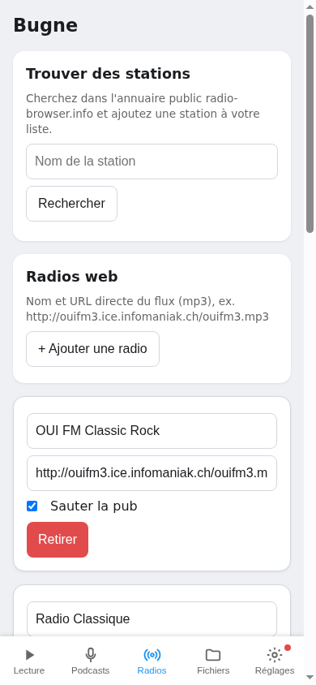
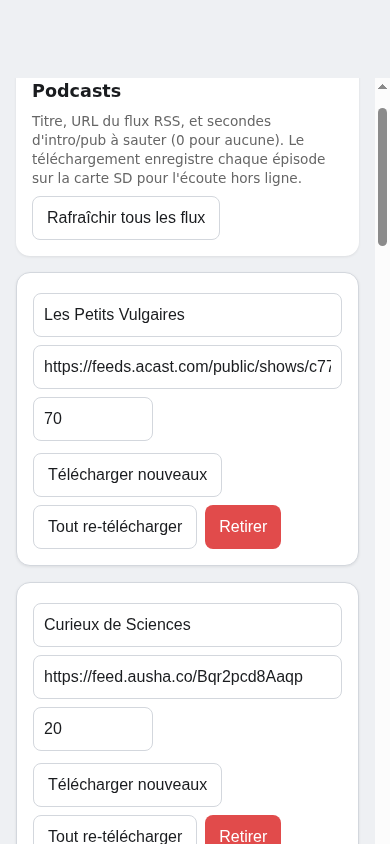

# Bugne : démarrage rapide

[English version](quickstart.md)

Du bureau vide à l'enfant qui écoute sa première radio, en cinq étapes :
acheter une carte, imprimer un boîtier, flasher le firmware une fois, la
connecter au Wi-Fi, ajouter radios et podcasts. La documentation complète
se trouve dans ce dépôt ; chaque étape ci-dessous renvoie vers la partie
concernée.

## 1. Quoi acheter

- La carte : une **LCDWIKI ES3C28P** (utilisez cette référence exacte).
  C'est un ESP32-S3 avec 16 Mo de flash et 8 Mo de PSRAM, un écran tactile
  capacitif de 2,8 pouces, un codec audio, un microphone, un lecteur
  microSD et un port USB. Le petit haut-parleur est fourni avec la carte.
  Rien à souder.
- Un câble USB de données et un ordinateur avec Python installé (pour le
  premier flash uniquement).
- Quelques petites vis autotaraudeuses pour fixer la carte et fermer le
  boîtier.
- Facultatif : une carte microSD (FAT32) pour votre musique et les
  épisodes de podcast hors ligne.
- La carte a un port batterie et un chargeur (LiPo 3,7 V à une cellule),
  mais le fonctionnement sur batterie n'a pas encore été testé par le
  projet et n'est pas conseillé pour l'instant : alimentez l'appareil par
  USB.

## 2. Quoi imprimer en 3D : le coffret seventies

Imprimez les quatre pièces du coffret seventies depuis le dossier
[`case/`](../case) :

- `es3c28p_seventies_corps.stl` (corps)
- `es3c28p_seventies_capot.stl` (capot arrière)
- `es3c28p_seventies_grille.stl` (grille de haut-parleur)
- `es3c28p_seventies_pied.stl` (pied)

Il s'imprime face contre le plateau, sans supports. Sur une imprimante
multi-couleurs, utilisez `es3c28p_seventies_corps+grille.step` pour
imprimer la grille dans une seconde couleur ; une seule couleur convient
aussi.

Deux modèles alternatifs (un boîtier simple en deux pièces et un poste
« vieille radio ») se trouvent dans le même dossier [`case/`](../case),
avec les scripts CadQuery qui génèrent tous les modèles.

## 3. Flasher le firmware (USB, une seule fois)

Une carte neuve a besoin d'un flash complet par USB. Toutes les mises à
jour suivantes s'installent par Wi-Fi depuis la page web, sans câble.

1. Installez esptool : `pip install esptool`.
2. Téléchargez `bugne-flash.zip` depuis la dernière version publiée sur
   <https://github.com/Tupile/bugne-releases/releases/latest> et
   décompressez-le.
3. Branchez la carte à l'ordinateur en USB.
4. Dans le dossier décompressé, lancez `./flash.sh --erase`
   (Linux/macOS). Sous Windows, lancez la commande `esptool` écrite dans
   `flash.sh`.
5. Si aucun port série n'est trouvé, maintenez le bouton BOOT en
   branchant le câble USB, puis relancez le script.

À la fin du script, l'appareil redémarre sous Bugne.

## 4. Connexion au Wi-Fi (suivez le QR code)

1. Comme l'appareil ne connaît encore aucun réseau Wi-Fi, il ouvre son
   propre point d'accès et affiche un QR code à l'écran.
2. Scannez ce QR code avec votre téléphone. Il rejoint le point d'accès
   nommé `Bugne-Setup-XXXX` (le XXXX est propre à votre appareil, tout
   comme le mot de passe du point d'accès, contenu dans le QR code).
3. La page de configuration s'ouvre toute seule après la connexion
   (sinon, ouvrez `http://192.168.4.1` dans le navigateur du téléphone).
4. Choisissez votre réseau Wi-Fi (2,4 GHz) et saisissez son mot de passe.
   L'appareil se connecte et le point d'accès disparaît.
5. La page de configuration est désormais disponible sur votre réseau, à
   l'adresse `http://bugne-xxxx.local` : scannez le QR affiché sur
   l'appareil dans Réglages, puis « Page de config (QR) », ou tapez
   l'adresse.

## 5. Ajouter les premières webradios et podcasts

Ouvrez `http://bugne-xxxx.local` depuis n'importe quel téléphone ou
ordinateur sur le même Wi-Fi.

**Onglet Radios** : cherchez dans l'annuaire public radio-browser.info et
ajoutez une station en un clic, ou ajoutez-en une à la main avec son nom
et l'URL directe de son flux. Les stations apparaissent aussitôt sur la
tuile Webradios de l'appareil.

**Onglet Podcasts** : ajoutez un podcast avec l'URL de son flux RSS.
« Télécharger nouveaux » enregistre les épisodes récents sur la carte
microSD pour l'écoute hors ligne.

Conseillé : dans l'onglet Réglages, définissez un mot de passe de page
pour que les enfants ne puissent pas ouvrir les réglages parents depuis
leurs propres appareils.

## Pour aller plus loin

- [Mode d'emploi](manual/fr.md) : usage quotidien, réveils, heures
  calmes, jeu des tables, accordeur, mises à jour, dépannage.
- [Notes matérielles](hardware.md) : brochage et détails de la carte
  (en anglais).
- [README](../README.md) : liste des fonctions et compilation depuis les
  sources (en anglais).
